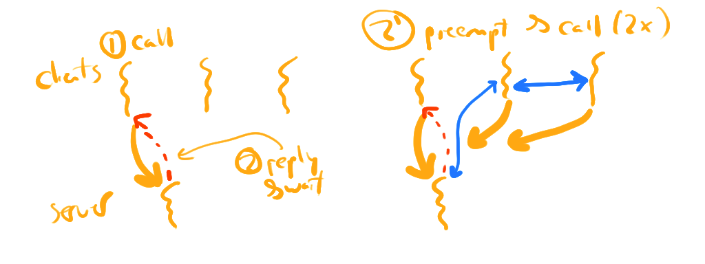

\newpage

# Frequently Asked Questions

## L1: Constraining Complexity

Section on "Complexity Management", and lecture [video](https://youtu.be/a8V2d33KvaE).

### Simplicity

- If you avoid generalizing your code, don't you pay for it later, and add more redundancy and complexity?
	You want to avoid generalizing immediately when you approach a problem.
	If you do start to have redundancy in your code, and it would lower complexity to generalize, then you should.
	Take this prescription as a proxy for "implement a concrete version of functionality before even considering generalizing; once you understand the system's complexities, generalize only where appropriate".
- How can over-generalizing increase complexity?
	Lets compare the code for an "[embedded radix trie](https://github.com/gwsystems/ps/blob/master/ps_ertrie.h)" in `parsec`.
	That code enables a radix trie of a configurable number of levels, with each node being of a configurable size, enables configuring how the pointers to each level is resolved (e.g. page-tables contain pointers to physical addresses, thus require translation to virtual addresses before dereferencing), etc...
	If you just need a radix trie with two levels that contains `void *`s, the code is simple:

	```c
	#define SZ_BITS 10
	#define SZ (1 << (SZ_BITS-1))
	struct simple_rt {
		void *ptrs[SZ];
	};
	void *lookup(struct simple_rt *r, uint32_t id) {
		struct simple_rt *level2;
		uint32_t lvl1_id = id >> SZ_BITS;
		uint32_t lvl2_id = id & (SZ-1);

		level2 = r->ptrs[lvl1_id];
		if (!level2) return NULL;
		return level2->ptrs[lvl2_id];
	}
	```

	This is much simpler, but not as general^[Note that `ps` is meant to be a library for supporting much more than just radix tries, so the complexity is likely warranted from the requirements, but the *first implementation* was certainly much simpler.].

### Modularity

- Are applications, modules?
	From a system-designer's perspective, Yes!
	We might think about an application as a simple `.c` file we load into the overall system's binary.
	This is the typical case for Real-Time OSes.
	In contrast, we can isolate, and dynamically load application "modules".
	From a system's perspective, we need to determine how we want to execute the modules we happen to call applications.
- A DAG model of system architecture seems too complex, and like it would push out development timelines; is this OK?
	Modern development practices certainly make a DAG structure seem complex.
	There is a beauty to being able to simply create a new application using the shell, rather than a web of connected modules.
	There is simplicity in having applications be layered above a large system call layer to all of the kernel's functionality.
	But there are costs WRT security for these decisions.
- In layered systems, how do you interact with lower levels that aren't directly below you?
	In a strict layered system, you can only interact with the layer below you.
	If a child, $c$, must leverage functionality below that (in layer $g$ -- grandparent), then your parent $p$, needs to provide an interface that calls $g$ for $c$.
	If a system does allow $c$ to directly leverage abstractions of $g$, this is called $p$-"bypass".
	Modern systems (like DPDK) enable device drivers at user-level which provide kernel-bypass -- you can send packets without kernel involvement!
- Is there any way to modify interfaces without causing required changes in modules?
	Yes.
	There are many changes that you can make in a "backwards compatible" manner.
	Adding new functions that only use existing functions, for instance, requires no changes in surrounding modules.
	However, these changes are limited in their power.
	The addition of functions requires changes in the implementing modules, but not those that depend on the system.
	Changes to *existing* functions require changes in both implementing and dependent modules.
	This yields a significant design space in which you can try and make changes that minimally impact surrounding modules, but the required functionality will also determine which option is available.
	Read more about interface versioning to understand how people wrap these decisions into a software design process, and semantic versioning to see how these options are encoded into version numbers.
- How do languages fit into the abstraction landscape?
	Languages are an abstraction that bridges the gap between human cognition, and computational models.
	Higher-level languages like Java, Haskell, or SQL disallow the human to express many things, but those constraints make it easier to write code that you can express.
	In contrast, C lets you express just about anything, but is a horrible language for complex application-level programming.
	Languages are interesting as they have a different *dimension* of trade-offs in the *logic* that underlies the language.
	Rust attempts to give you the ability to express the same effects as C, and constrains what you can do with the language using the *type system*.
	As such, the trade-off you make is in programming logical model complexity -- developers must come to understand affine types, borrowing/ownership, interior mutability, etc... before leveraging the language.

	I would not put languages into the same "class" as the modules and interfaces we're discussing in the class.
	The interface with human cognition makes them into a different beast.
	However, they are not all-together dissimilar from the concepts of abstraction we'll focus on in systems.
- How do layering and hierarchy fit into the separation/isolation we know about in systems (e.g. kernel/user)?
	They are, in many ways orthogonal concepts.
	Modularity is a statement about handling system complexity.
	However, pairing modularity with isolation is, of course, a key system concept, and how we consider fault isolation and security constraints in addition to addressing complexity.
- How does a component relate to a module?
	For the purposes of this class (and most other purposes), they are equivalent.
	I use the term "module" here as it is the term used in the referenced books.
- How is modularity different from abstraction?
	How I introduce them, abstraction is about constraining complexity, and structuring interactions with resources.
	Modularity is about information hiding, and replaceability -- implementing abstractions in software.
	At the highest-level, abstraction is the conceptual idea, and modularity is about making it real.

### Technical Debt and Accidental Complexity

- When do you go back and pay off the technical debt?
	This is always a function of three things:

	1. what the development "velocity" of the current system is with the technical debt (think: the average productivity per day of each developer),
	2. what would the development velocity be if you removed technical debt, and
	3. how long will it take to remove the technical debt?

	Often the velocity doesn't matter as a deadline makes 3. intractable.
	However, a team's architect should make the call about when to work down technical debt based on the long-term ability of the team to function.

	Example: we used to only support a "fork-style" creation of new protection domains in Composite (as it was easy to implement).
	It was creating a great many problems as time went on (fork is not composable with many different abstractions).
	Thus, we spent some time to implement a `posix_spawn`-like API, and it sped up our research significantly.
	I noticed that we still weren't as agile as we should be, so we implemented the Composite Runtime (`crt`) library to remove a lot of accidental complexity in the system APIs.
- Is there a certain amount of technical debt that's allowed?
	Absolutely.
	It is always an engineering decision.
	Do you have the developer time to spare to remove it, or not?
	If so, improve the code base.
	This is a very nuanced decision.
- Is there a way to quantify technical debt?
	Not that I know of.
	In some sense, it is quite subjective.
	Until we can quantify "proper design", I'm bearish on quantifying technical debt.
- Is it not better to plan your software development to minimize technical debt?
	Absolutely.
	However, this is not a sufficient solution due to two factors:

	1. You cannot preemptively understand all impacts of planned features.
		There are always complexities that you simply didn't "see" at design time.
		It is not uncommon for these to provide awkward "contortions" in the code to fit them into the planned design.
	2. Software is not designed once, implemented, then static.
		We receive new design requirements and feature requests *after* you've spent the time on the design.
		These new requirements might require significant changes in the existing design to avoid technical debt.
		Your team might not have time for this restructuring.
- What do we do when we find our self introducing unexpected accidental complexity?
	You have to make the call: do you go back and redesign to remove the friction, or do you continue on and accept the debt.
	We're engineers, and this is a trade-off we have to make frequently -- better to make it consciously than not.

### Semantic Gap

- What types of semantic gaps exist?
	There are those that are due to simply a large gap between the abstractions a system provides, and those required to implement a functionality.
	For this type, one could easily install or implement new layers of abstractions to bridge the gap.
	There are those that are due to a gap between the abstraction provided and that of those required where there is a fundamental incompatibility between the two.
	Abstractions *are opinionated*.
	They disallow certain ways of using the system.
	If one of these disallowed uses is required by the new module, then there isn't a means to bridge the semantic gap.
	The underlying system is simply fundamentally inappropriate for the task at hand.

## C1: System Interfaces and Zircon

- What differentiates systems programs vs. application programs?
	A simple set of differences get at the main point.

	1. System services define APIs, while applications use them.
		Thus, services define the abstractions of the system, applications use them.
	2. This is confusing when you consider that libraries also define APIs but aren't often considered system services.
		This is because libraries don't need to not just define resources, but also multiplex and control access to them across multiple applications.
	3. As the system service cannot share its memory resources with an application (lest that application corrupt its data-structures), it cannot provide pointers to the client to refer to its resources.
		Thus, system services often provide handles (integers, or a level of indirection) to bind the clients references to the resource.
		Correspondingly, you will see this in many system designs.
- Why do different clients require different mapping functions from names to resources?
	Rephrasing: why do different processes have different virtual address spaces?
	They should only be able to address potentially different sets of resources (pages of memory).
	Containers are another good example of this: two containers have different views of the FS to increase isolation and customizability!
	Even without containers, directory access rights can prevent some users from seeing some resources.
- Do we care about system design concerns (naming, etc...) differently in systems with different system structures (e.g. a monolithic system vs. a micro-kernel)?
	These are pretty universal concerns.
	In monolithic systems, the handle-based bindings are exposed to user-level, while pointer-based bindings are used between different system modules.
	In micro-kernels, you typically require handle-based bindings between each service (as they cannot share pointers).

### Action Aggregation

- Action aggregation is terrifying; how can we securely implement it?
	Yes, it is terrifying.
	You're running user-code on your system!
	You always want to run user-code in a "sandbox" -- i.e. a controlled environment in which they can only access resources you've explicitly granted them.
	You need to pair that with a constrained API that prevents the user from doing "bad things".
	This is why most technologies for this use higher-level languages (like SQL for stored procedures, and lua for game policy programming), or carefully constructed sandboxes (ebpf and Webassembly).

	An example for which you can more easily understand the security story: if you're installing software on your system, the software server is conceptually uploading a shell script onto your system that contains the programmatic logic of installation.
	What do you have to do to make this secure?
	Make sure that the shell script cannot access parts of the FS outside of what you want, memory-limit the script, make sure that it is CPU-limited, thus cannot monopolize the cores, etc...

### Event notification

- How do event notification systems handle races on modifications and accesses to the resources?
	If we're told via an event notification API that a pipe has data, then before we can read from it someone else consumes the data, any further processing assuming that the event is still pending is misguided.
	Level-triggered APIs (that return the *current* state of the system -- i.e. if there is an event active *now*) help, but you can always have a race between when the event notification API returns, and you try and access the resource.
	There is no solution to this aside from tightly constraining who can access the objects (files) your waiting for events on.
- Are "handles" the "fds" of zircon?
	Yes.
	They are the dynamic bindings to the kernel resources.
- How does "liveness" work for kernel objects?
	Some kernel resources have access to other handles (e.g. thread/process).
	When you close a handle, the "kernel resources" are supposed to be cleaned up.
	How does this happen with these handles that have handles?
	All kernel objects are reference counted, so they are removed when there are no more references to them.
	In this "nested" case, removing the handle to the thread might mean that the contained handles are no longer referenced, thus will also be deallocated.

### Threads vs. Events for Concurrency Control

- Thread vs. event driven architecture trade-offs?
	Simply put, we need threads if we want to execute on multiple cores.
	We often want events (and event loops) when we want high scalability with controlled memory consumption (no thread stacks).
	Unfortunately naive event programming is not fun and requires "stack ripping" or nested closures.
	Modern languages have gotten smart and are able to turn functions into state-machines that look like threaded code, but are, behind the scenes, event-driven code (see `async/await` in javascript and Rust).
	There are arguments that [events are better](https://web.stanford.edu/~ouster/cgi-bin/papers/threads.pdf), and that [threads are better](http://capriccio.cs.berkeley.edu/pubs/threads-hotos-2003.pdf), but I think that the world has shown that they are just [multiple tools for the job](https://lwn.net/Articles/223980/).
- Why do event-driven APIs require non-blocking?
	If we block on a system call, we cannot service any other pending events.
	Thus blocking is bad when you want a single thread to service multiple event sources.
	But if `select`/`epoll` told you that there was data on a file, why do you care if the system call is blocking or not?
	You shouldn't block as you know data is available on it, right?
	Event notification APIs tell you that there is data available, not *how much* data is available.
	With blocking APIs, it is really hard to know when you've read all available data.
- Do systems provide both threaded and event-driven?
	Yes!
	They provide both thread APIs, and event notification APIs with the option of asynchronous APIs.


## L2: Interface Design and Properties

### State Management

- The less our design leverages global state, the better?
	Generally, yes.
	It is much easier to test, and implement functions that are isolated from the effects of other functions -- in some sense, avoiding global state massively increases compositionality.
	However, it is impossible to provide many system services with this property.
	We always have some global structures as they track the state of system resources.
- Is idempotency equivalent to deterministic functions in math?
	No.
	Deterministic functions (if I understand the referenced concept) return output based solely on the input.
	These are *pure* functions or (as I said in the lecture) "stateless".
	Idempotent functions can have output based on "hidden" state (think, a cache, a disk, etc...).
	If some of those operations can *change* the state, then another otherwise idempotent functions retrieve that state, the retrieval functions are not idempotent with respect to the update operations.
	However, the retrieval and update operations are likely idempotent with respect to themselves.
	A simplistic (and common) view on idempotency ignores the relationship of these functions to each other.
- Is it possible to have a thread-safe function be re-entrant?
	Yes.
	A few examples (I'm sure there are more, but these are the ones that popped into my head):

	1. You can use recursive/re-entrant locks (see the book), and track if your own thread is already processing in a critical section, and figure out some way to proceed without touching the shared structures (e.g. return some failure mode).
	2. You can use wait-free algorithms that only use atomic instructions, and avoid `cas` loops, thus can proceed in the signal handler regardless where the preemption happened in the main thread's execution.
- Which functions actually *are* re-entrant?
	`strtok_r` stores the state in the arguments passed in, thus will execute re-entrantly for different sets of arguments; similar arguments apply to many of the `str*` class of `string.h` functions; and, generally, any API that depend only on arguments to compute the results.
	Careful implementation in stateful functions can also be re-entrant, but this requires a lot of consideration and work; most modern libraries don't consider this, and instead require that signal handlers are simple and restricted in scope.

### Trading Complexity for Performance

- Which of these aspects of interface design do we prioritize if we're on a deadline, and can't do it all?
	Depends on the goals of the system.
	You really don't want to bake into the API, designs that support many clients, thus you have to life with the API forever-more.
	If it is a "public" API, you really want to get it right.
	API design is usually worth the design time spent on it.
	You can fix a simplistic or faulty implementation, but backwards compatibility makes you always have to live with API mistakes.
- Should we always choose performance over the "nice-to-have" interface properties?
	No.
	We often design systems and ask "what operations *must* be fast".
	We define a "fast-path" in the system (or multiple), and focus optimizations around that.
	Once we do that, we want to make the API as easy to use as possible in general, and depart from that ease of use to make the fast-path efficient.
	Linux doesn't really have this luxury as the "fast paths" differ across the vast number of applications.
	However, most systems that we implement are much more specialized, and do have the luxury to be more opinionated about what we optimize for.

### Designing for Composability and Orthogonality

- Are there mechanisms to avoid breaking orthogonality?
	Not that I know of.
	That's why we're discussing it in the class: if you're aware of the goals, you can consider them in interface creation.
	If you break then, then you can do so intentionally, and document why.
- Is there a general way to create composable APIs for shared resources?
	Not that I know of.
	A common technique, if we can call it that, is to make the API more complicated to handle changes that span multiple API calls.
	They are conceptually similar to the `cas` atomic instructions:

	1. one of the API functions returns a "token" that records the state of the system,
	2. each subsequent call takes that token, and will make modifications contingent on not conflicting with other parallel modifications.

	The general idea is to "make modifications only if the state is as expected", and this is a composable function that can be tied together into higher-level operations.
	Many web caches provide an API to set a key to a value *only if* the value was previously some specific value.
	This is similar and generalized to [Optimistic Concurrency Control (OCC)](https://en.wikipedia.org/wiki/Optimistic_concurrency_control) in data-bases.

	An additional technique is to provide a "token" as part of the API that specifies which "portion" of the backing state is being modified and queried.
	A good example of this is [session tokens](https://en.wikipedia.org/wiki/Session_(computer_science)) that are used to identify a specific user that is interacting with a webpage over multiple requests (think the "paging" required by the "next" links to query subsequent data items).

	[Software transactional memory](https://en.wikipedia.org/wiki/Software_transactional_memory) (STM) in Haskell/Clojure implements APIs essentially based on the "make modifications only if state is as expected", and are able to hide the complexity of the API behind a coherent library abstraction.
	They both rely on the functional behavior of the underlying system to make this practical, thus this technique is not generally applicable to systems -- that are *not* functional (e.g. stateless or pure).

	However, these are examples.
	I don't know of any general -- or prescribed -- techniques to create composable APIs.
- Is the API composable if some of the functions, or the resources in state, can compose, but others cannot?
	Within a given API, the composability constraints can be documented.
	We often define a protocol (or state-machine) which can define the state of the resources being modified, and only specific functions can apply to resources in specific states.
	There is an inherent protocol in networking connection creation that flows through `socket`, `bind`, `listen`, `accept`, and `read`.
	These functions are *not* arbitrarily composable, instead they can only operate on a resource (the socket) when it is in a specific state (as defined by the previous functions used to operate on it).

	That said, we often worry more about the composability of different APIs together.
	Does `fork` compose with `pthread`s?
	Do `pthread`s compose with `errno`?
	Do signals compose with blocking ("long") system calls?
	No, no, and no.
	We must focus not only on "self composability" (and document constraints on that), but also on the composability of different, potentially "interfering" with each -- demonstrating a lack of composability.

### Commutativity

- How can `open` not commute -- two calls, regardless the order seem identical for all functionality that matters, right?
	For a user's perspective, it *feels* like they are identical.
	From a shell's perspective, they are *not*.
	For example, `sh` in `xv6` *requires* that the order of opens translates into *specific* file descriptors being allocated (see the [careful dance](https://github.com/gwu-cs-os/gwu-xv6/blob/master/sh.c#L100-L112) with `close` and `dup` when creating pipes).
	More importantly, the *specification* of how *open* and *dup* behave is what we assess when judging commutativity.
	Human perceived importance of various behaviors in APIs are not very relevant, only the specification.
	POSIX's *specification* requiring allocation of the lowest-free file descriptor ensures that two `open` (or `dup`) calls do *not* commute.
	This means that an implementation that adheres to this specification cannot be scalable.
	This hopefully emphasizes why the *specification*, not a *sense* about what part of APIs are important, is the relevant detail to focus on.

### Moar Interfaces, MOAR

- With respect to liveness: if a user opens a file, thus in some sense owns the reference to the file, and is responsible for `close`ing it, what happens if the user doesn't?
	The reference will stick around!!!
	When a process `exit`s, all of its referenced are cleaned up, and at that point the file will be released (and potentially freed if all other references are removed from it).
	There is a very deep, worrisome problem here: we are using up kernel resources (memory and potentially disk) to store the file.
	Are we "charging" (i.e. *accounting* for) those resources properly?
	Are they counted against the total amount of memory/disk that the process/user is using?
	This is a very difficult problem to solve.
	To make proper resource *allocation* decisions, we often want to consider how much of a resource some user/process is already using, and allocate more to those that are using fewer (as an example policy).
	Without proper accounting, a potential attack is opened up where the user can use many more resources than it should be able to by consuming service's resources on their behalf.
	This is made all the more complicated when those resources are "shared" between processes.
	Do we proportionally "charge" each process?
	If so, one process removing a reference will *increase* the amount that others are charged.
	This is odd: your resource consumption accounting goes *up* through no action of your own.
	Hard stuff.
- Do we ever remove API functions in systems -- for example, system calls in Linux?
	Not really.
	Certainly Linux doesn't remove system calls.
	So long as there are users of the API, to remove it you have to either 1. be willing to break existing applications (see Python's transition to 3.0), or 2. provide a reasonable transition plan to support the old functions in libraries (e.g. support the old APIs in a library by using underlying composable APIs of the other functions of the interface).

## C2: A Study in Event Models: Demikernel and `libuv`

### Demikernel Questions

- Why have all of the complexity of merge/map/filter/sort?
	These are convenient APIs that are meant to generate a higher-level programming API encouraging varies forms of composition.
	As this is research, it absolutely is *not clear* if this complexity pays off.
	We'll have to look at a variety of applications to judge this.
- What is a scatter/gather array?
	Instead of passing in an array of data, you pass in an array of references to separate arrays of data.
	If you're "gathering" you asking for data to be sent out from one of these arrays of references by accessing each of the separate data arrays, in order.
	If you're "scattering", you're asking to receive data that will be split across all of the subsequently referenced data arrays.
	See `writev` and `readv` for more documentation.
- Why are there so many different types of queues?
	DK is using queues polymorphically here, so we can "speak" the queue API, and it can talk to disks, networks, or pipes, depending on the backing resource.
	This is similar to the VFS API in UNIX.
- Does kernel-bypass bring more security issues?
	Yes.
	As there is no isolation between I/O subsystems, and the application, so a bug in either will impact both.
	That said, there is effectively a single application executing on the system, so at least such a bug will not span the data of multiple principals.
- Can DK work with multiple applications?
	Unlikely.
	They would generally have to be in the same address space, and the "event loop" of DK would have to change to enable one application to block while another computes.
	These goals are challenging when using kernel bypass.
- Is avoiding blocking really that beneficial?
	Blocking means that you have the overhead of interrupts, and mode transitions, which *are too much* in many data-center operations.
	Polling avoids all of those overheads and enables the application to get the lowest-latency access to data at the lowest overhead.
	The downside is that we're burning CPU cycles on polling, and preventing other applications for executing.
- Instead of doing kernel bypass, could the kernel just export queues to user-level; would it still be fast?
	Yes!
	See the work by Jens Axboe on [`io_ring`](https://lwn.net/Articles/776703/) support that has [matured](https://lwn.net/Articles/810414/) quite a bit to do exactly this.
	Writing a DK backend to `io_ring`s wouldn't be that challenging.
	There would be a performance hit, for sure.
	Additional overheads would include interrupts (that DK avoids using DPDK), copying data across user/kernel boundary, and mode transitions.
	The latter would be minimized, most likely due to buffering (remember "data aggregation" as an optimization technique).
- Generally, do we really get much better performance by doing kernel bypass?
	If you're doing fast computations in response to packets, **yes**.
	Networking interfaces can push data fast enough that at a maximum packet rate, you don't have enough time to service a single cache miss.
	100Gb/s is an extraordinary data rate that is twice the throughput of the fastest current DRAM (see DDR5 [here](https://en.wikipedia.org/wiki/Double_data_rate#Relation_of_bandwidth_and_frequency))!
	It is necessary to avoid mode transition and interrupt costs for such systems.

	If your application does a fair amount of computation for a request (e.g. a webserver), then you'll get diminishing returns for saving the overheads of interrupts and mode transitions.
	Consequently, the benefit is quite application-specific.
	One domain that clearly benefits: network function virtualization -- where we push many of the router/smart network functionalities into software.

### libuv Questions

- Why all the wrappers around functions like thread operations?
	Portability across systems.
	You want to define a common API that doesn't have too large a semantic gap to the APIs exposed by all OSes you want to support.
- Documentation specifies that you can run an event loop per thread.
	Why?
	Each event loop often implies blocking waiting for one of the events that has been registered.
	If you're blocking waiting in "one of the event loops", you might never wake up.
	If you don't when are you going to handle events from the "other loop"?
	Really the more fundamental issue is that you have two different sets of resources that are separately blocked on.
- Why does libuv support two separate callbacks for `uv_read_cb` and `uv_udp_recv_cb`?
	Likely because UDP is a datagram-based protocol, so each packet has "framing".
	Each packet is meant to received a single unit, rather than as part of a larger stream of all packets (as in TCP).
	Thus two callbacks: the latter understands that the data passed in is a single packet.
	If this hypothesis is correct, then it would be better named `uv_dgram_recv_cb` (note the `DGRAM` option for sockets that motivates the shortening of the word).

## L3: Composite Resources

- Does a component in which a thread executes have to have access to the thread's capability?
	No.
	A sane system will only let the scheduler have access to capabilities to threads; only the scheduler should have thread dispatching privileges!
- How can scheduling work when it is more of a free-for-all of context switches?
	Most components should not have access to the thread capabilities.
	Only the scheduler should.
	Thus the only context switches derive from the scheduler's context-switches (on thread capabilities), interrupt activations of threads on asynchronous activation end-points, and timer interrupts firing and switching back to the scheduler thread.

	The key thing to understand is this:
	we've discussed the *mechanisms* for access control (capability-based access), but *still must discuss the policy*.
	For example, a necessary policy to have sanity in scheduler implementation is that the scheduler is *the only component with capabilities to the threads it schedules*, and to have all asynchronous activation end-points for the threads it schedules have the "parent" set to the scheduler's thread's end-point.
	The mechanisms are not alone sufficient to implement a sane system.
	Abstractions and organization must be *layered on top of the raw mechanisms* to derive predictable behavior.
- It seems like we have a comparable number of resources now exposed to user-level rather than raw hardware mechanisms; have we made progress?
	Is this better?
	Yes, it is better.
	Once we have provided the ability to harness and guide the raw hardware resources with *user-level, safe interfaces*, we have now enabled:

	1. multiple user-level components to define how to use and orchestrate the resources in different ways;
	2. system specialization by providing developers with the tools to manage resources in application-specific ways;
	3. increased isolation in make the system more fault resilient and secure.

- Do synchronous invocations avoid the kernel?
	No!
	They end up making effectively two system calls, thus go through the kernel twice -- once for invocation, and once for return.
- How could you support virtualization on this system?
	See the Nova system we'll go over quite a bit in this class.
- How is isolation provided with synchronous invocations?
	What if the thread crashes or goes into an infinite loop in the server?
	The execution in the server cannot access the memory of the client.
	A failure in the server does not necessarily cause a crash in the client, and vice-versa a client crash.
	If there is a fault (or a perceived fault) in the server, it is possible to implement an exception model in which a "return" happens to the client, and executes and error path (e.g. a `catch` block).

	Note that if the server goes into an infinite loop, the client will be impacted.
	However, this is a limitation of *all synchronous APIs*.

	There are other complications.
	If we make a synchronous call while holding a lock in the client, the client is opening itself up to failures.
	Such an action is tying the progress of the threads in the client, to progress in the server.
	As such, critical sections should really not make synchronous invocations, unless you're willing to tie their progress together.
- How does any of this work on multiple cores?
	The scheduler thread must now consider multiple cores?
	Synchronous invocations into the same component on multiple cores seems complicated?
	There is a scheduler thread per-core, and schedulers can only switch to threads that are bound to that core.
	There are other APIs to change which core a thread is bound to.
	Scheduler threads can coordinate through shared memory, or by using inter-processor interrupts.
	This situation is quite similar to how Linux implements its scheduling queues.

	Synchronous invocations imply that servers must be concurrent and parallel.
	They must use locks and consider races at all times.
	This is a downside of synchronous invocations.
- The kernel should not trust user-level but if you move the scheduler to user-level it must now trust it for proper scheduling; how can this be safe?
	Microkernels general export most abstractions to user-level.
	If a user-level file system doesn't work, then those applications the depend on it might experience faulty service.
	This system is simply treating scheduling the same way -- put it in user-level and any service that depends on it might fail if the scheduler fails.
	A big difference with the FS analogy is that not all components must depend on the FS, but all of them must depend on a scheduler.
	Not discussed here is a mechanism (Temporal Capabilities -- i.e. capabilities for time) that enables there to be multiple schedulers in the system, and a fault in one only imples failures in the components the depend in it, but the other components can keep on running uninhibited.
- Why do synchronous invocations, and why not just have a server thread that is communicated with?
	We'll talk about this for about two weeks, but for now you can watch the [gory-level-of-details-preview](https://www.youtube.com/watch?v=_qrP8jQ-eoc).

## L4: Capability Delegation and Revocation

- How does moving the delegation tree to user-level help the $O(N)$ costs?
	Costs in server are still caused by clients, right?
	The clients can still do many delegations that will result in revocation taking a long time, in the context of the revoking thread.
	In that sense, this doesn't help.
	However, now the $O(N)$ cost is not incurred while in the kernel.
	Many microkernels execute non-preemptively, and for them, moving this cost to preemptible user-level is quite useful.
- Related: aren't there still $O(N)$ costs in the capability manager?
	Yes!
	We have implemented the capability manager to limit the number of delegations to keep this at $O(1)$.
- How can it be safe to have a component with access to its own capability tables?
	It can modify the resources accessible from its own capability-table, but can only add resources that it already has access to (e.g. by retyping)!
	Thus, being able to modify our own resource table does not give us scope of access beyond our own resource tables.
	It just allows us to retype, and use resources we already have access to.
- If we don't have recursive revocation, come up with an example of "bad things" happening.
	If we give access to a page to a "kernel" in a VM-like subsystem, and then, that kernel delegates the page to an "application", and the VM fails, we have a sticky situation.
	If we revoke the kernel's page, we really *need* to have that revoke operation remove the application's access as well.
	Fundamentally, we don't track the delegation to the application, so something in the system must track the delegation tree and revoke it from the application.
- Does recursive revocation use recursion?
	No.
	It has also been called "nested revocation", which might be less misleading.
	It is always implemented using an iterative algorithm.
- Can you revoke only a single other protection domain's access?
	Yes you often can.
	You can target a specific delegation to remove the subtree rooted at that delegation.
- Can there be loops in the delegation tree (back to a "parent" component)?
	"Yes" in the sense that the same component can exist in the same tree.
	They can actually be tight loops.
	A component can delegate a page to itself, meaning you have shared memory with yourself, and both delegations are in the same components.
	Comparably, two components could delegate a page to each other.
	"No" in the sense that the tree cannot become a cycle.
	Two mappings in the same component are still a tree of delegations.
- Is there a non-copying version of delegation in which the previous component does not retain control?
	Historically, this is called "grant", and is not supported by most capability-based OSes.
	Composite does support the equivalent of this.
	Instead of *copying* a capability across capability tables, there is also a *move* operation.
- Can a child revoke the resource given by its server?
	Does this remove it from the server?
	No, it cannot.
	You can only revoke the subtree of delegations rooted at your capability.
	If a server delegates to the child, then the server's capability is closer to the root of the tree, rather than in the subtree.

### Other

- With only a single scheduler, how does multi-core scheduling work?
	A single scheduler can be executed in parallel on multiple cores, similar to how processes can be multi-threaded.
	In this case, the (single) scheduler can partition its runqueue so that each core's runqueues track only threads that are "bound" to that core.
- How does moving a thread from a core onto another work?
	We have not implemented this yet.
	We will create a thread operation to change the core a thread is bound to.
- How does permission to access a device work?
	Is it a single capability?
	It is not a single capability.
	Usually devices have two components:

	1. memory mapped I/O -- which is essentially a specific range of physical memory for which loads and stores are interpreted as reads and writes to device registers, and
	2. interrupts which are hooked into using the vPIC.

	So capabilities to use devices boil down to having the memory mappings in a components virtual memory to the physical memory of the device, and the interrupt hooked up to a asynchronous receive end-point that is used to send interrupt notifications.
- Why are device drivers the most unreliable part of the OS, generally?
	They are often written by computer engineers that have less coding experience, and by people who are not kernel developers.
- Why would we want a non-preemptive kernel?
	It vastly simplifies the kernel to not have to consider preemptions at all lines of code.
	Additionally, this combines with kernels that don't block as it means that we need only a single kernel stack per core, rather than per-thread.

## L5: Memory Retyping and Management

- Can you take memory that has been typed as UVM and eventually type it to KM at some later point?
- When is memory cleared?
	Whenever a kernel structure is `deactivate`d, or whenever a UVM is retyped into UTM.
	As such, you know that the previous contents of the page will never be accessed as a different type.
- If we want a slab/buddy allocator, we still have to have that logic; do we save anything by moving it to user-level?
	We can have a complex memory allocator in a component, for sure.
	However, we can also implement simple systems along-side that don't have to suffer from that complexity.
- Example with radix trie and `cons` (esp. with the addr); how is the address used?
	When we `cons` a second level page-table entry into the top-level page-table entry, we specify the address it should be `cons`ed at.
	The top level node of the page-table essentially translates (on 32-bit x86) the highest 10 bits of the virtual address.
	Thus when we specify the address for the second-level node to be hooked into, the top 10 bits of that address are the only relevant bits.
- Where does the untyped memory come from?
	It is added to the constructor's resource tables at boot time.
	There are no APIs to allocate new untyped memory.
	The constructor uses some amount of untyped memory to construct other components, then delegates the rest of UTM to the capmgr.
- Why do we want superpages?
	Pages larger than 4KiB are useful because of the TLB.
	The TLB has a limited number of entries, $T$.
	Thus you can think that the amount of virtual memory accessible through the TLB is $4096 \times\ T$.
	If the application frequently accesses more than that value (i.e. its working set is larger), then you will get capacity TLB misses, which will slow the application down.
	If pages are larger than that, say 2MiB or 1GiB, the amount of virtual memory that can be held in the TLB without misses is much higher.
	So superpages are useful for applications that use a large amount of virtual memory (e.g. databases).
- Can you take memory that has been typed as UVM and eventually type it to KM at some later point?
	Yes.
	The memory state machine we discussed means that you can move memory, over the lifetime of the system, between all of the states.
- Why stop at UVM/KM/UTM?
	Why not shared memory, etc...
	Shared memory is effectively already tracked (if UVM and the `refcnt` > 1), so there is no need for a state for it.
	The same is true for many of the other types of states that you might want.
- Where do we store the reference counts?
	In an array in the *kernel*, with one entry per system page.
- Are there other, better, ways to determine complexity than lines of code?
	See earlier in the book, we reference automatic metrics like cyclomatic complexity, but nothing is very perfect.
	There is a very "human aspect" to complexity that is hard to capture in a metric.
	Lines of code is a decent proxy, but far from perfect.
	If a lot of the lines of code are in system initialization, we might not really want to count them toward system complexity as aren't executed in the dynamic execution of the system.
- With what metrics should we evaluate an OS?
	Generally: performance (e.g. efficiency, parallelism), trustworthiness, capability (does it have the features you'd like?), security and reliability, and predictability (ability to do computation by the time it is necessary).
	It very much depends on your domain what you prioritize as it is generally impossible (given engineering optimizations for limited resources) to be strong in all of these.
- What is kernel integrity?
	There is no integrity if a user-level computation can either cause the kernel to crash, or corrupt its data-structures.
	Integrity is preventing that from happening (bugs in the kernel aside).
- Does memory retyping increase memory fragmentation?
	In some ways, yes.
	First, we track memory on a page-granularity, which effectively means that kernel data-structures are also sized to a page.
	Other microkernels allow memory tracking down to much smaller sizes, but they also need to allocate more objects in memory (in Composite, it is just capability- and page-table nodes, threads, and tcaps).
	Second, we might split UTM in the system between multiple components (i.e. different ranges of physical memory will be accessible to separate components), thus removing the possibility to have allocations that would have otherwise spanned the two ranges of UTM.
	Partitioning UTM is generally done at a very low-level in the system (to partition different VMs, for example), and then the separate spans of UTM are separately managed by the different subsystems (VMs).
	Thus, the fragmentation isn't an issue.
	The issue that it presents is that a subsystem might not have enough memory to be successful, which is analogous to if you run a VM without giving it enough physical memory.
- Is it possible to starve the kernel of memory?
	The kernel doesn't generally allocate memory on its own without provocation.
	Generally, it allocates memory *on behalf of* an application.
	This mechanism could mean that user-level doesn't provide any kernel-typed memory to, for example, allocate a thread.
	However, this is generally OK.
	If an application is trying to create a thread, it should *provide the memory for creating that thread (or have someone delegate that memory on its behalf)!!!*.
	The core of the memory retyping is that an application should verify it has access to some memory resource before using it -- a relatively intuitive notion.
	Memory retyping simply takes this intuition and *also applies it to kernel allocations on behalf of the application*.
- If we want a slab/buddy allocator, we still have to have that logic; do we save anything by moving it to user-level?
	One can still implement subsystems that *do not require that logic*, thus can avoid the complexity.
	Other subsystems (e.g. running Linux) can include that complexity if they want it.
	The general idea is that if we require complexity in the kernel, then the entire system must "suffer" for that original sin.
	If we can move the *option* of having the complexity to user-level, and enable competing implementations, then you only pay the cost if you want it.
	The constructor doesn't need it.
	The capability manager doesn't need it.
	Therefore, we can increase the reliability and simplicity of those subsystems that really must be trusted.
- Can a component grant another component some memory like it can with capability?
	Yes.
	UTM, KM, and UVM are all tracked as normal resources in the component's resource tables.
	Normal methods of copying/moving/removing access to these resources are enabled.
- If components have to manage their own policies for managing memory, how does this affect application development complexity?
	The `cos_kernel_api` which is used by `crt` provides the logic for doing all of this, so you can judge how much that makes applications more complex.
	It is often the case that we will want to delegate the responsibility for managing memory to another component, so that it can do allocations for us.
	This is a large part of what the current capability manager does.
	This enables the manager to split the memory, in accordance with demand, among multiple components, rather than requiring that we strictly partition the memory between applications.

## L6: UNIX

- Given all the modern UNIXish innovations, could the creators have done a better job?
	Maybe not.
	That would have taken time and resources.
	It was more valuable to get the idea out than to predict 50 years of development.
- Can a program wait for multiple events in UNIX?
	For file descriptors, only with the event multiplexing APIs like `select`, `poll`, and `epoll`.
	However, for the other event sources (signals, timers, etc...), you basically have to use a separate process or thread to wait on those, and then use IPC (or inter-thread communication) to convey the events to the thread in the "event loop".
	This is often conveyed by writing to a pipe, the read-side for which is being `select`ed on, thus integrating the event into the main file-descriptor-based event loop.
- How did UNIX wait on multiple events before the changes discussed for Linux?
	See the previous bullet!
	Each event wrote to a pipe fd, and the read-side was integrated into the `select` event multiplexing.
- Is call/return style interaction the same as callbacks?
	No.
	Call/return is "function call semantics".
	So it is synchronous, and passes a set of arguments, while (when the server is done computing) returning return values.
	Callbacks are a concurrency programming style (not an IPC semantics) -- execute a callback when an event occurs.
	A server can implement the call/return style using callbacks -- when the client invokes the server, the server can execute a callback in response to that even.
- What is a typed interface?
	Quite literally think of an `interface` in Java.
	Each method has a type that includes object types passed in and returned.
	The client passes in types that have a bit-layout that is identically understood by the server (i.e. they both understand where each field is, etc...).
	This tightly couples the client and server.
	Note that bit-streams (that use, for example, text to structure the data) can be used to pass typed information, which is what protobufs, thrift, and grpc all do.
- Why `ioctl`?
	It essentially provides an untyped interface that can be used to pass arbitrary arguments and return values from a user process to a kernel module.
	In this way, it is infinitely extensible!
	If you want to add a new function to use for process/kernel module communication, you can simply do so!
	However, this freedom essentially means that you're giving up on providing well thought-out abstractions, and are instead just saying "whatever, modules can decide".
	You can't blame a module that later implements a dangerous or non-orthogonal interface.
- Can we see an example of a process that introspects on itself as it executes?
	`cat /proc/self/maps` tells the process executing the `cat` program which memory maps it has as part of its virtual address space!
	You can also modify some of the files in `/proc/self` to actually modify the program that is making the modifications.
- What is coming after UNIX?
	We actually see that right now!
	Linux is UNIX++, as is.
	See the Eurosys paper referenced in the chapter to see how Android and Ubuntu expand on UNIX; they already are the next evolution.
	OSX is UNIX + Mach and has turned into a system with its own native interfaces.
	In some sense most systems are UNIX, but they are also "beyond UNIX".
- What is the problem with "long system calls"?
	An example of what you have to add to *all* of your long system calls:

	```c
	int again;
	do {
		again = 0;
		if (read(...) < 0) {
		if (errno == EINTR) {
			 again = 1;
		}
	} while (again);
	```

	There might be slightly clearer ways to write the code, but the point is that signals complicate composition with all long system calls.
	You *must* include the logic for this checking simply because signals exist.
	Do you think that every library that you use does this properly?
	Unlikely.
- Do the tacked on solutions offered by Linux and other systems hinder orthogonality?
	Yes.
	Binder and D-Bus both expand the number of options you can use for IPC.
	Which should you use?
	There are other examples.
	What we have seen, however, is that higher-level libraries become the de-facto standard, and they use whichever underlying mechanism (despite there being competing implementations of that functionality) they want everyone to use in the system.
	OSX does this frequently by pushing their development stack.
	Grand Dispatch Central is the default concurrency and parallelism framework as it is the foundation behind their runtimes that you essentially have to use to do development.
	This is, in some sense, the benefit of having corporate decision making behind the software.
- Is there not a contradiction between "do one thing well", and the instances of a lack of orthogonality?
	Yes!
	I wouldn't "read into this" that much: this is simply an implementation not meeting up to a philosophy.
	It doesn't change the underlying philosophy, just teaches us how to do better next time.
- How can you say "done one thing well", and have `ioctl`?
	You got me!
	I think it was a simple acknowledgement that hardware interfaces have changed a ton over time.
	Given this massive change, `ioctl` is a good "patch" to make progress while the hardware changes out beneath us.
	More worrisome is that `ioctl` has been used for such a larger set of functionality beyond device configuration.
	When you "give an inch, they take a yard", or "if you provide user-level with an interface, it will be used to the maximum of its capabilities".

### Interaction between modules

Lets discuss multiple programming models for communication between modules.
This is complicated as it involves concurrency, data movement, synchronization, and, different means of means of programming.

- Streaming of bitstreams

	```c
	while (1) {
		data = read(input);
		output = process(data);
		write(output);
	}
	```
	You might have multiple of these programs stringed together with pipes (from `stdout` in one computation to `stdin` in the next).

	Note that we might think of "typed streams" as using json or a bit-wise encoding to organize the streamed data.
	This would look a lot more like retrieving and processing tuples in a db.

- Call-return

	```c
	client(...) {
		output = server_fn(foo, bar, baz);
		process(output);
	}
	```

	```c
	server_fn(a, b, c) {
		return process(a, b, c)
	}
	```

- Single module, distributed execution (Spark, Mapreduce)

	```rust
	output = stream
		.map(|data| process(data))
		.filter(|data| if w00t(data) Some(data) else None)
		.reduce(|data, result| result + process(data));
	```

	Is converted into:

	```rust
	while (1) {
		data = read(input);
		output = [];
		for d in data {
			output.append(process(d));
		}
		write(output);
	}

	while (1) {
		data = read(input);
		output = [];
		for d in data {
			if w00t(data) {
				output.append(d);
			}
		}
		write(output);
	}

	while (1) {
		data = read(input);
		output = [];
		for d in data {
			output.append(process(d));
		}
		write(output);
	}
	```
	Where each module can be deployed in a separate process.

## L7: Middleware/Frameworks and Application-based Composition

- What is the relationship between `inetd` and `systemd`?
	`systemd` subsumes all of the responsibilities of `inetd`.
	`inetd` is simply the precursor that showed the power of having a daemon that mediates access to other daemons, thus allowing them to be started on demand, and restarted automatically.
- How do we walk the line of developer-composed, and user-composed?
	Developer-composed is unavoidable; this is how modern development is done.
	Put another way, think of how many people 30 years ago were what we'd think of as "power users"?
	What fraction of current computer users *today* are power users?
	Less than 1%?
	Likely.
	We require developers to compose abstractions in a way that is tailored for specific market niches (i.e. user requirements).
	We should be quite *thankful* for this.
	It is what keeps us employed...for now.

	So it is inevitable that we have developer composition.
	However, the important question is more-so about how the abstractions the modules that developers compose are formed.
	You will *all* do library/framework development.
	How do you break that library into pieces?
	How do you compose that library with others?
	How do you integrate with the underlying Linux system?
	These are the questions that emphasize the remnants of UNIX design: we still want to focus on

	- separation of concerns (i.e. do one thing well),
	- composition,
	- orthogonality,
	- the separation of mechanism and policy, and
	- simplicity.

	So how do developers handle this?
	Remember the precepts of UNIX design when developing the systems that compose into your applications.
	Make exceptions to this design philosophy when you need to, but make sure that is the exceptional case.
- Would a Linux that moved memory management and scheduling into user-level even still be UNIX?
	Perhaps; it might implement POSIX, which is a decent approximation of "are you a UNIX?".
	However, the premise of the question is where the complexity is.
	You could *not* move scheduling and memory management from the kernel to user-level simply because the kernel is implemented in such a way that it *depends* on memory management and scheduling.
	If the kernel depends on some functionality, it cannot easily be implemented at user-level.
	Even if it could, you'd have to ask the question if it is really useful.
	A crash in the scheduler would still take down the entire system.
	You'd have to pair that with the ability to have *multiple* schedulers and memory managers so that they can independently fail.
	Now you're likely just looking at a capability-based OS.
	So you'd have to get rid of the foundational elements of Linux to make this modification.
- Are containers worth it over virtualization?
	In cloud infrastructures, unlikely.
	On your laptop, likely.
	We are trading away isolation when we use containers, while achieving lower resource consumption.
	When security isn't really an issue, and you simply want to leverage the dependency-resolution, developer-centric aspects of the abstraction, then containers are great.
	When you need strong isolation, VMs are better.
- Is Linux a microkernel now?
	Moving functionality to user-level (`systemd`, multi-process frameworks, user-level device drivers (USB, bluetooth), user-level file systems (FUSE)), and having complex IPC facilities are properties of microkernels.
	But they are not the definition of microkernels.
	Microkernels attempt to minimize the kernel to support user-level definition of resource management and access control policy.
	Linux is in *now way* doing this.

	Linux *is* adopting features of microkernels.
	But because the core of the system is not implemented to provide them efficiently, you see the huge performance disparity (200 $\mu$sec for D-Bus vs. 0.3 $\mu$-sec for Composite).
- Are the daemons, the middleware talked about in the book?
	Yes.
	"Daemons" are essentially the "services" we've talked about previously in the class.
	They provide abstractions and are leveraged by clients.
	Libraries play into this as libraries are often used to interact with these services without writing a bunch of annoying broiler-plate IPC code.
	That said, libraries are more general (and provide functionality apart from services) as well.
- What is D-Bus again?
	It is just a means to do IPC between different clients and different services using either function-call-like call/return, or publisher-subscriber communication.
	Both are useful for `systemd` as it can look at a request for interaction with a service as a trigger to actually start that service, thus executing them on-demand.
- Are there systems that use the heightened performance from microkernel IPC to make systemd-like coordination faster?
	Not really.
	Most applications that use D-Bus are written in a way that they understand that the performance is horrible.
	Thus speeding them up won't matter much.
	Put another way, D-Bus is never used in performance-centric environments.
	Making infrequent operations faster doesn't have a large impact on the system as a whole.

	An implication of this is that D-Bus could *not* be used as a core system composition facility.
- If D-Bus works OK, why is `kdbus` (and other kernel-based implementations) being considered?
	Performance, mainly.
	But there are arguments that getting things like resource consumption attribution (proper accounting) right with the user-level version is impossible.
	Can a client cause the service to consume a huge amount of memory without the client being charged for it?
	There's a link in the book that discusses this case.

## L8: Plan 9

- Was Plan 9 created when distributed systems were popular?
	Yes.
	In the 80s distributed systems were *very* popular.
	They petered out until the cloud took over around 2004.
	Thus distributed computation is a first-class design concern in Plan 9.
- Are symlinks similar to `bind`?
	Somewhat.
	They do create an alias within the namespace to an existing name.
	However, `bind` is much more powerful.
	It enables the *files* in a directory to all be bound into a directory, and for them to co-exist with existing names (files) already there.
	What happens if there is a name that you're binding into a directory that is the *same* as an existing name in the bind point?
	Interestingly, in Plan 9, directories are *not sets*!
	You can have multiple identical names in a directory.
	When opening a file, you open the *first* instance of that name in the directory.
	Thus, when you `bind`, you specify if the new names are bound *before* or *after* the existing resources.
- Why can't we just have a `ctl` file in `/proc/` that we write to create a new process?
	The challenge is in the edge-cases.
	How do you pass it the initial file-descriptors it should use?
	How would a shell initialize its `stdin` and `stdout`?
	How do we do that, without suffering from races between the process executing and us modifying the resources it has access to?

	I'm convinced that all of these problems could be addressed.
	However, they are challenging problems.
	It isn't clear if, once we have a solution, the performance would be acceptable.
- How do daemons fit into this system?
	Daemons are replaced with the services that expose their resources in the namespace (using 9p).
- "It simultaneously makes sense to me but feels way too simple." when describing the network examples in the book.
	Yes!
	Well constructed abstractions often enable you to do very powerful things, very simply.
	This is one of the best descriptions I've seen for the benefits of this type of a system.
- Why does Linux not use any of these stuff?
	Why does this stuff matter if we can do everything we want in Linux?
	Think of how many human-hours of work, and how many lines of code are required to do what can be done in a 100 line shell script in Plan 9.
	Now think of how much time we all have to spend maintaining and modifying those massively complex systems?
	We have gotten very good at working *within the confines of massive complexity*.
	That doesn't mean that we shouldn't try to design abstractions that can *avoid that complexity* wholesale.

	If there is one thing that I want you to understand, it is this:
	Accidential complexity can be massive.
	It is also difficult to identify it.
	When looking at `ssh`, you might not see much accidental complexity.
	To some degree, the same probably can be said about `systemd`.
	But you have to take a step back, and realise: the **fundamental organizational abstractions have a huge impact on the accidental complexity of the surrounding system**.
	We must always strive to design our systems in a manner that forms abstractions cleanly to avoid the next 10 years of accidental complexity.
- How secure are the transparent distribution facilities in Plan 9?
	I haven't looked deeply into the details, but lots of [cool details](https://www.usenix.org/conference/11th-usenix-security-symposium/presentation/security-plan-9) to dive into.
- What does it mean that "IPC can have a serialized representation"?
	IPC is often simply trying to invoke some function in another process, pass some arguments, and return the return value(s).
	So if we want IPC to go over a network, we simply need a way to lay out the target function, the arguments, and the return values into a bytestream.
	JSON, for example, is a serial representation, and could be used here.
	This has some overhead: converting from the arguments and return values passed similar to normal function invocations is fast, while converting them into a sequence of bytes that can be transmitted over the network has additional overhead.
- What does it mean for "resources to span the network"?
	This essentially means that we can access remote resources.
	The local resources are being accessed by computations on remote nodes!
	Put a fancy way, the resources are accessed locally, and remotely, thus they are conceptually covering the span of the nodes on the network.
- What does it mean for a service to "expose its resources in the namespace"?
	Each application or service can figure out how it wants to represent the abstract resources it provides to the other services and applications in the hierarchical namespace.
	If an email service wants to provide access to emails to applications and users, it can choose to have a different directory for each mail, with a series of files holding the title, contents, attachements, etc...
	In this way, the service is exposing its abstract resources to users in the namespace.
	Remember services take lower-level resources, apply their own policy, and expose them as more abstract resources -- and Plan 9 provides a unform means of exposing them!
- How does a file operation become a 9P message?
	The kernel will receive the system-call (e.g. `read`) on a specific path in the namespace, identify which services (process) is mounted at the path, create a 9P message (a serialized version of `read`), and essentially write that message to a pipe that the service is reading from.
- Is everything a file; how about scheduling and memory?
	More abstractions are files compared to UNIX.
	However, memory, rendezvous between threads, process (creation), and scheduling are *not* represented as files.
	They all have specialized implementations in the kernel.
- Linux has net and IPC namespaces (along with 5 other namespaces); how are these managed?
	They are managed using special system calls, specific to the namespaces.
	The difference between Linux here and Plan 9 is that the namespaces are not unified around the hierarchical namespace.
	Thus, containers must have separate code and logic for handling each different namespace.
- Can a Plan 9 exist with no filesystem?
	Plan 9 requires the hierarchical namespace, but it does not require disk-based backing.
	All of the namespace could be populated by virtual files provided by servers.
	Of course, you need a way to run all of those servers, so you might need an initial ramfs.
	This could allow "thin terminals" that don't have many local resources (e.g. disk), and instead use remote resources.

## L9: IPC Implementation and Optimization

- Is IPC overhead ever the bottleneck of the system?
	Yes.
	If IPC is replacing system calls (for example), if that IPC overhead is a bottleneck (i.e. a dominant cost) is only a function of the frequency of the calls.
	Webservers can certainly make a system call every few microseconds, thus being significantly impacted if IPC takes a microsecond (read about webserver CGI and the motivation for FastCGI from long ago for some background).
- It is easy to understand priorities, but how does a "budget" impact scheduling?
	Budgets capture the idea that there is a finite amount of computation allocated to a thread.
	As the thread executes, its "budget" decreases correspondingly.
	Once the budget is expended, the scheduler will suspend the thread.
	Later, the budget can be replenished, thus re-activating the thread.
	One simple way to think about budgets and replenishments is this: a thread has $b$ cycles worth of budget every $p$ period of time.
	Thus, replenishments happen for up to $b$ cycles every $p$ cycles.
	As such, that thread will be able to use *at most* a fraction $b/p$ of a core.
	The idea behind budgets is often to make sure that higher-priority execution is prevented from starving other threads.
	Linux has `cgroups` that are a hacky implementation of budgets that are used to provide enhanced isolation for containers.
- Can't we just use shared memory for the asynchronous IPC case as well to avoid buffering?
	You can use shared memory for communication between asynchronous threads.
	However, you often still need to copy data into the shared memory (from the client-side), and then out (on the server-side), so you don't really save copies.
	It is generally nicer to rely on the kernel to do the data-movement, but not required.
- Why would synchronous IPC ever use asynchronous APIs?
	Asynchronous APIs similar to `read`/`write` are general in that a client can insert arbitrary logic between the `write` (to request service), and the `read` (to get the return values).
	They also provide the core of the VFS API.
	I don't know why, but it is likely another instance of technological momentum.

### Sync. IPC between threads

- Why is `s.prio > c.prio` (for all `c`) a problem?
	If the server takes *t* amount of time to execute, then a low-priority client *l* could invoke the server, and immediately afterwards a medium priority thread, *m*, could activate (e.g. through an interrupt).
	This means that *l* can delay *m*'s execution -- despite *l* being lower priority than *m* -- for *t* cycles.
- How can a middle priority thread, *m*, prevent the higher priority thread, *h*, from executing when the server has a lower priority, *l*?
	Lets go through a potential sequence of actions:

	1. client *h* does synchronous IPC with server *l*.
	1. *l* is preempted by *m*.
	1. *m* executes for a potentially unbounded span of time.

	As such, the result is that *m* can indefinitely block *h*, despite being lower priority.

- Why does Credo use (i.e. "inherit") the priority of all clients awaiting service, and the budget of the client that is being serviced?
	If a server that is processing for a client has a number of additional clients waiting for it to finish, we would give that server the maximum of the priorities of the clients (if we use the inheritance policy).
	This avoids the middle-priority problem above.

	But what about "transitive" blocking relationships.
	If a client blocks on sync. IPC with a server, and that blocks on sync. IPC with another server, and that blocks on sync. IPC from the server above, it is important that we also consider this client's priority in the inheritance as well!
	Thus, we must essentially give a server the maximum priority of *all* threads that are blocked on, and transitively blocked on IPC with the server.
- Why are the synchronous IPC optimizations able to avoid an in-kernel buffer?
	Both the client and server, when "rendezvous"ing together are both blocked.
	Since neither is modifying their own buffer since they're blocked, the kernel can copy direction from one buffer to the other.
- What impact does asynchronous programming (programming the client and server to use asynchronous interfaces) have?
	For async., a client must have logic for event notification (when might a server have a reply?) -- remember `select` and `epoll`?
	This increases the complexity of the client.
	Now we need mechanisms for 1. awaiting multiple responses, and 2. logic to handle each response separately.
	Remember `libuv`?
	That is a solution to this problem!
	Make request to the Linux kernel to do I/O, but don't block (i.e. asynchronously make the request), have a library that awaits completion of all of the, and invokes a *callback function* associated with the pending request.
	Callbacks and event-based programming can be a little horrible to program, so javascript, rust, and C# (and likely other languages I don't know about) have `async`/`await` that use the compiler to hide the callback execution behind what looks like sequential code.
- When using the synchronous IPC between threads optimization that avoids modifying scheduling structures, how can a timer interrupt know that the server is running?
	The kernel almost always maintains a global variable pointing to the "current" thread.
	So the kernel can trivially know that the server is active by observing that variable.
	It can immediately add the server to the runqueue as it now knows it is runnable.
	If it finds that a client (blocked waiting on a server, but not yet removed from the runqueue) is the highest-priority thread, the scheduler will always check that the thread's state is actually *runnable* before switching to it.
	If it is not runnalbe, but is part of the runqueue, the scheduler can simply remove it from the runqueue, and then find the next highest priority thread.
	Unfortunately, this can cause *O(n)* overhead in the scheduler.
- What are the data-structures that track thread interactions in L4?
	See the image:



### Thread Migration

- What happens with thread migration when two clients try and get service from a single server; does one block?
	Nope!
	They both proceed execution in the server.
	This is why servers must be multi-threaded: when *N* clients invoke the server, you end up with *N* threads executing in the server.
	A side-effect of this is that you need to use locks and other synchronization primitives in the server.
	The kernel *has no blocking APIs*, and instead moves that responsibility for user-level definition.
- Thread migration downsides don't feel like real downsides; how are they a negative?
	If you can write code that isn't multi-threaded, it will generally have less complexity than code that is written to be multi-threaded.
	The need for locks, the non-composability of locks, deadlock, and race conditions all make multi-threaded code more difficult to get right.
	If only a single thread executes in a body of code (as with single-threaded servers), you might avoid some of that complexity.
	So in this sense, the multi-threaded side-effect of thread migration is certainly a downside.
- When do we switch between stacks in thread migration?
	The kernel will save the stack and instruction pointers to return to in the client (when the IPC has completed), and then sets the instruction pointer to the entry point designed in the synchronous invocation callgate resource in the server.
	The kernel then "upcalls" into the server (i.e. switches from kernel to user-level).
	The first job of the user-level code is to acquire a stack!
	The downside of this is that the initial code executed in the server is an assembly stub, but it quickly acquires a stack, and then calls the C handler for the target function.
	On return, the saved IP/SP in the client are restored before switching back to the client.
- If you can have multiple schedulers in Composite, can you have different schedulers on each core?
	You absolutely can!
	You don't need to have the same set of schedulers on each core.
- What are the data-structures used to track execution during IPC using thread migration?
	See the image:


## L10: Security Foundations

- How can large systems like Docker be mathematically verified?
	Practically, they cannot.
	Only relatively simple software (e.g. microkernels) can currently be verified.
	This justifies why you'd want the software that must be at the core of your TCB to be simple and small (as in microkernels).
	Experience in verifying a 10K Lines of Code (LoC) microkernel is that the amount of proof code to verify it is on the order of 200K LoC.
	So it is not realistically possible to verify a million lines of code.
- What is an alternative to path-based namespacing of resources?
	CBOSes use a flat namespace of capabilities to reference resources.
	`memcached` uses a flat "key" namespace to index cached objects.
- Does Linux's open-source and "million eyes" policy make it more or less secure?
	It is hard to know for sure without companies with popular proprietary OSes sharing more information about their security.
	The benefit of open development is that more people will have the opportunity to catch bugs.
	The downside, of course, is that adversaries have access to all of the source code, so have to reverse-engineer less behavior to find exploits.
	A long-standing principle of secure system design is that "security through obscurity" does not work.
	Just because an implementation is hidden, does not make it more secure.
	The main question, for me, is simply if the kernel developers (and more importantly, the kernel development *process*) result in code that is thoroughly vetted for security.
	Security cannot be a secondary consideration in system design.
	If it is, adversaries having access to the code can be quite dangerous.
	But, fundamentally, adversaries having access to the code doesn't make them less secure.
	Exploitable bugs do and will exist in each system.
- It seems like the principles of the economy of mechanism, and separation of privilege seem to conflict; do they?
	In one sense, breaking privilege across different protection domains seems like it will create more mechanism in the system (to create and manage protection domains).
	However, this is only true when viewed in isolation.
	When a system is viewed holistically, there is a pervasive need for protection domains independent of the separation of privilege.
	Thus, this is code and "mechanism" that will exist regardless of separation of privilege.

	However, it is likely true that the separation of the privilege will increase the complexity of the application itself.
	In this way, these are minorly in opposition.
	It is important to understand the motivation behind the principles, so that the correct trade-offs can be made here.
- Why compare processes to containers and VMs?
	Aren't processes not like the others?
	Processes in UNIX are intended to be the unit of isolation.
	Even in containers, this is still true.
	Thus, you want to compare these thinking of them all as units of isolation in the system.
	However, it is challenging to isolation processes from each other as they access the same file system.
	They can easily communicate (which might compromise confidentiality) by simply sharing files in `/tmp/`; they see each other's process information in `/proc`, and a simple attack on the `root` account will prevent any semblance of CIA.
- How is tamperproof-ness possible?
	It seems like DoSes are always possible, at the very least, right?
	If the refmon includes no bugs (it faithfully implements a specification), and the specification prevents any modifications of the refmon, then the refmon is tamperproof!
	If it isn't formally verified, but is small enough that we can gain confidence in its implementation, then it has a high-degree of (but not absolute) tamperproof-ness.
	There are always complications, and there is a question of how far you're willing to go.
	For example, do we want to prevent the image of the refmon on persistent store from being modified when the system is powered off?
	Do we want to prevent the hardware from being tampered with?
- Is it really possible to formally verify the code?
	Yes!
	seL4 is a formally verified microkernel.
	The "proofs" are often written in languages like Coq and Isabelle/Hol.
	These proofs are automatically checked by the computer to verify their veracity, and the proofs are written considering the actual code that executes on the system.
	Imagine doing proofs by contradiction in a proof programming language that are checked for correctness by the computer!
- Is the separation of privilege (SoP) just a combination of the principle of least privilege (PoLP) and the principle of least common mechanism (PoLCM)?
	PoLP is intended to limit the functional interfaces and resources that we have access to to exactly those required to complete a job.
	PoLCM dictates that you should share as few modules between two untrusting applications as possible.
	The SoP is a prescription to break a single module into multiple coordinating modules.
	SoP will likely result in a system in which the PoLP can be more powerfully applied: each smaller module likely uses only a subset of the resources compared to before they were broken into multiple modules.
	However, the PoLCM is really a statement about the modules that are shared between applications.
	I don't see a relationship between applying SoP and an increase in PoLCM.
- In a CBOS, why does the refmon index into capability tables to find the resource pointer instead of just enabling the application to have the resource pointer?
	Applications cannot have pointers to the resources in the general case as those resources are likely data-structures in the kernel.
	User-level cannot safely directly reference kernel data-structures.
	Thus the capability table, and the CBOS system call handler provides a controlled set of operations that can be performed only on the resources a component has been given access to.
- When would the CBOS add a reference into the capability table for a component?
	During the delegation operation, or during the retyping of memory into a specific resource (i.e. creating a thread from untyped memory).
- Don't economy of mechanism (EoM) and Defense in Depth (DoD) contradict each other?
	Yes, often.
	However, if you already have a massively complex system (e.g. Linux), then DoD is really your main "go to" options to increase security.
	You don't fundamentally make the system more secure, but you do make it much more practically difficult for the attacker to subvert the system.
- Is a system secure if it is successfully used on a massive number of webservers?
	When talking about the security of systems, the "attack surface" is important.
	The attack surface of a webserver is 1. the networking stack, and 2. the webserver parsing and other logic.
	So you typically have to compromise the webserver, and *then* attempt to compromise the entire system (if that's your goal).
	When considering if the OS seeks to provide strong security, we have to consider: once an attacker has access to the webserver, will it be able to break CIA?
	Many web-facing systems assume that if the webserver is compromised, the game is over, and the attacker has access to everything.
	A fundamentally secure system might be able to separate the webserver from any other execution, and all resources outside of those necessary to make the webserver work.
	In such a system, an attacker wouldn't be able to do as many "bad things" as in a monolithic system in which a hacker has an easier path to take over the entire system.
- How does Linux prevent 0-day bugs?
	Is it just manual code review that helps it stay secure?
	Manual code inspection is the main, traditional path.
	More recently unit tests, [fuzzing](https://www.kernel.org/doc/html/v4.14/dev-tools/kcov.html), and compiler techniques (e.g. [KASAN](https://www.kernel.org/doc/html/v4.14/dev-tools/kasan.html), [sparse](https://www.kernel.org/doc/html/v4.14/dev-tools/sparse.html), and [UBSAN](https://www.kernel.org/doc/html/v4.14/dev-tools/ubsan.html)) are used to increase confidence in the code (e.g. look for undefined behaviors).
	None of these techniques prove correctness, and simply try to find as many bugs as they can.
- Are there examples of defense in depth in OSes (not just browsers)?
	[ASLR](https://en.wikipedia.org/wiki/Address_space_layout_randomization), security modules (see book), [w^x](https://en.wikipedia.org/wiki/W%5EX), and countless other techniques are part of the OS playbook for trying to raise barriers for attackers.
- When should security be designed into the system?
	If you want a fundamentally secure system, you very much want to design the system from the ground up at the start.
	However, most systems have to figure out how to design security *into the system* post-hoc.
	Many of the defense in depth techniques are added to systems that weren't designed for security.
- How far does security have to go when we don't even really trust kernel devs (e.g. driver developers)?
	This is part of the motivation for microkernels: we don't have to trust all modules in the OS if they are mutually isolated from each other.
	They can (with plenty of engineering) fail separately.
	Even Linux enables some low-performance devices to be implemented in user-level!
	It is only the lack of fast IPC that motivates placing devices in the kernel, in general.
	Kernel bypass approaches such as DPDK (used in the Demikernel) are designed primarily to move devices to user-level!
- What in Linux assigns read/write/execute bits?
	Is this the refmon?
	Start-up programs, programs to create user accounts, and users (with `chmod`) set these bits.
	UNIX uses discretionary access control (DAC) in which a user (or `root`) can change any of these bits on their files.
