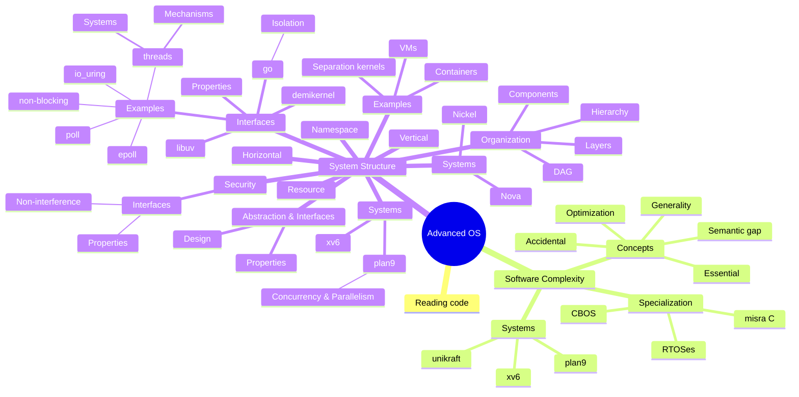

# Advanced Operating Systems

**Gabe Parmer**

© Gabe Parmer, 2024, All rights reserved

---

# Gabe :wave:

---

## Concepts

- Complexity, system structure, and interfaces
- Interface and system design
- Isolation and security
- Concurrency and parallelism

---

## Skills

- Reading & understanding code
- Practicing and applying system design
- Understand the design of a microkernel
- Design and implement OS features

---

## Prerequisites

- :bangbang: Comfortable & experienced with one of C/C++/Rust
  - **Reading large C codebases**
  - **Writing C**
- Understand core ideas of OSes
  - Interrupts/exceptions/preemption
  - System calls
  - Scheduling
  - Parallelism and multi-core
  - Page-tables & memory virtualization/isolation
  - Some UNIX familiarity

---

## Systems & Software

Systems:

- Linux, Windows, Android, `systemd`/`initrc`, containers

Software:

- UNIX & beyond: `xv6`, `busybox`, `plan9`
- Performance & concurrency: `demikernel`, `go`, `libuv`
- Microkernels: `nova`, **`composite`**
- Specialization: `unikraft`, `composite`
- Separation kernel: `nickel`, `komodo`

---

| Topic | Systems |
|-------|---------|
| Reading Code                       | `xv6`                   |
| System Complexity                  | `plan9`                 |
| System Structure - layering, hierarchy, components (DAG) | unix, `plan9`, windows  |
| Interfaces and Properties          |                       |
| Isolation - namespaces, resources, and binding | `plan9`, `composite`      |
| Isolation - horizontal vs. vertical, design principles | `nova`, `composite`       |
| Concurrency                 | `go`, `libuv`, `demikernel` |
| Parallelism            | `go`, `libuv`, `nova`       |
| Specialization | `composite`, `unikraft` |
| Security | `nickel`, `composite` |
| Android | android, fuchsia |
| Resource management | cgroups |

---

---

## Class Organization

:one:: Understand concepts $\to$ read existing systems $\to$ understand concepts++

| Day                   | Class             | Course Work               |
|-----------------------------|------------------------|-------------------------|
| Thurs                    | *Gabe*: concepts/systems | -             |
| Tues $\to$ Tues: | -             | *You*: understand code/design, ~1-1.5hr |
| Tues                     | *You*: discuss studied system in group, All: discuss together, discuss next system | -              |

:two:: Implement systems in 1. a UNIX service, and 2. a new design in an existing system.

---

## Class Organization

Tests? Graded homeworks? :-1: :poop:

Incentive management:

- In class discussion of system design - Peer evaluation. If you aren't prepared for class, your group will suffer.
- System Design Review & Participation - Notes and questions about system + class participation.
- Coding - design notes, and presentation.

You'll get out of this class what you put into it :shrug:

> Self motivation is required to get **anything** from this class

---

## Working Together and Academic Honesty

- You can work in teams for any aspect of the class.
- You must fill in your own participation reflecting on code.
- You can use the Internet and/or LLMs.

Attribution is *required*.

---

## Attribution

If you use code or gain significant ideas from elsewhere, you *must* cite that source.
- Use code from the Internet? Add a URL to the source.
- Use an LLM to gen code? Identify which LLM and the gist of the queries.
- Work with someone else? List them in the README.md or in a comment.

No attribution? `0` credit.
