# System Structure

<div class="center">

**Gabe Parmer**

© Gabe Parmer, 2024, All rights reserved

</div>

---

# Abstraction

A simplified representation
- Omits details
- Encodes operations and abstractions over local state

Implemented in a **module/component**

---

## Abstraction Examples

- Filesystem
- Socket
- File descriptor
- Virtual Memory
- Thread
- Process
- Databases
- DOM
- ...

---

## Abstraction Properties

1. Interface
   - Programmer mechanism(s) to leverage abstraction
2. Implementation
   - Details of how the abstraction is provided
3. Resource interface
   - How the abstraction updates system resources

---

## Abstraction Properties

1. Interface - Programmer mechanism(s) to leverage abstraction
   - FS?
   - Process?
   - Virtual Memory?
   - DB?
2. Implementation - Details of how the abstraction is provided
3. Resource interface - How the abstraction updates system resources

---

## Abstraction Properties

1. Interface - Programmer mechanism(s) to leverage abstraction
2. Implementation - Details of how the abstraction is provided
3. Resource interface - How the abstraction updates system resources
   - FS?
   - DB?

```c []
struct sched_param sp;
sp.sched_priority = 10;
sched_setparam(getpid(), &sp);
```

---

## Shallow vs. Deep Components

How **wide** is the interface relative to the implementation?

- Narrow interface w/ significant implementation
  - Hides significant complexity
  - Organizes significant state

- Wide interface
  - Exposes more details about the implementation
  - Doesn't hide the complexity as much

**Deep components provide stronger abstraction**  <!-- .element: class="fragment" data-fragment-index="1" -->

---

## Shallow vs. Deep: Analogy


---

## Shallow vs. Deep: Analogy


---

## Shallow vs. Deep: Analogy


---

## Shallow vs. Deep: Analogy


---

## Depth of Abstraction

<div class="center">

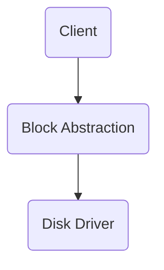

</div>

Disk driver:
- Interface: block read/write
- Implementation: interrupts, DMA, registers

---


```c [1-3|5-14|11-13]
/* Block Abstraction */
int block_read(int offset, char *block);
int block_write(int offset, char *data);

/* Client Code */
void client(void)
{
	char block[4096];
	char *msg = "hello world";

	if (block_read(10, block) < 0) err();
	strncpy(block, msg, strlen(msg) + 1);
	if (block_write(10, block)) err();
}
```


Notes:
- What if we're preempted before the write, and someone else modifies the block?
- How does this interface differ from a SSD device driver?

---

## Abstraction Width

The *width* of the `block_*` abstraction is very small.
- But provides little *abstraction*

Examples of similar abstractions:
- [`virtio_blk`](https://projectacrn.github.io/latest/developer-guides/hld/virtio-blk.html)
- Linux [Logical Volume Manager](https://en.wikipedia.org/wiki/Logical_Volume_Manager_(Linux)) (LVM)
- [Exokernel](https://pdos.csail.mit.edu/papers/exo-sosp97/exo-sosp97.html) block interface

---

## Abstraction Width

Interface to DBs?
- SQLite: `sqlite_exec(db_conn, "sql command...", ...)`
- Postgres: `PQexec(db_conn, "sql command...")`

Interface width $\neq$ number of functions <!-- .element: class="fragment" data-fragment-index="1" -->
- DB interface includes a full-fledged language  <!-- .element: class="fragment" data-fragment-index="1" -->

---

## Shallow vs. Deep Components

Be wary of nuance in how you think about this.

---

## Deep Components

Unix Virtual File System Abstraction
- remarkably small API for a ton of functionality
- see the [xv6](https://github.com/gwu-cs-advos/xv6-riscv) source

```c []
int open(const char *pathname, int flags, mode_t mode);
off_t lseek(int fd, off_t offset, int whence);
ssize_t write(int fd, const void buf[], size_t count);
ssize_t read(int fd, void buf[], size_t count);
int close(int fd);
```

---

## Deep Components - Semantic Gap

Risk of deep components: The abstraction makes some actions impossible
- What if we want two files to share some blocks?
- What if we want to [share some of the page-tables](https://lwn.net/Articles/895217/) between processes?
- What if we want to [directly talk to devices](https://www.dpdk.org/) at user-level?

Semantic gap - If a task requires capabilities hidden and made inaccessible by the abstraction.  <!-- .element: class="fragment" data-fragment-index="1" -->

---

## Deep Component - Networking Example

`socket`s augment the VFS API to enable network communication

- Streaming enables TCP/IP, without needing to know the details
- But one can also use UDP if they require more per-packet control

---

## Shallow Components

Expose *internal implementation details* in the interface

- Example: an interface close to that of a data-structure - linked list API, `block_*` interface w/ simple implementation
- *Couples component and client logic*
  - Defeats point of abstraction!
  - Complicates component updates
  - Moves complexity to client

Leaky abstractions - an abstraction that reveals or requires client to have knowledge of implementation details.  <!-- .element: class="fragment" data-fragment-index="1" -->

---

## [Leaky Abstractions](https://www.joelonsoftware.com/2002/11/11/the-law-of-leaky-abstractions/)

- Networking: latency spikes
  - TCP over wireless
- DBs: performance
  - manually specifying indices
  - denormalizing for performance
- CPU caches: performance
  - update data-structure granularity to cache-lines

Complexity is passed to the client

---

## Extending Interfaces w/ Leaks

Default design goal:

1. Deep component, narrow interface
2. Optimized interface for *common case* usage
   - For example, avoid whatever led to Java's `FileInputStream`, `BufferedInputStream`, I/O mess
3. Semantic gap? $\to$ [extend interface](https://ieeexplore.ieee.org/document/183036) for more control where necessary

---

## Deep Component with Shallow Extension

```c []
int ioctl(int fd, unsigned long op, ...);
```

> Arguments,  returns, and semantics of ioctl() vary according to the device driver in question (the call is used as a catch-all for operations that don't cleanly fit the UNIX stream I/O model). - Manual page for `ioctl`

- Vague, explicitly "cuts through" the abstraction
- Specific, by design, and not general

---

## File Access Shallow Extension

```c []
void *mmap(void *addr, size_t length, int prot, int flags, int fd, off_t offset);
```

- Extension enables elision of system calls for file modifications
- Doesn't work on any `fd`, provides memory that doesn't behave like memory
- Have to understand what's happening in the abstraction
  - only works on files
  - relies on eagerly created file contents (cannot `mmap` "files" in `/proc/`)

---

## Interface Extension Examples

Bridge the semantic gap, acknowledging leaky abstraction:

- `CREATE INDEX idxname ON table (col0, col1, ...)`
- `fsync` - to await data written to disk
- `O_DIRECT` - disable file's FS caching
- `setsockopt` - configure socket behavior
- `mlock` - memory should have mem-access latency
- `madvise` - `MADV_DONTNEED` "don't need this memory now, and when I access it next, it should be zeroed"
- `prefetch`, `clflush`, `mfence`, `movnti` - cache exception instructions

---

# Modularity: Organizing Components

---

## Systems Must Have Multiple Components

- What is the granularity of components?
- How are component's related?

---

## How Should we Organize Software Components?

---

## Complexity with Components

Well-designed, deep components constrain complexity for their abstractions
- But the *relationships* between components can be complex
- $N$ components that can talk to any other would need to track $N^2$ interactions
- Broad component *coupling* has [security](https://www.hbs.edu/faculty/Publication%20Files/18-031_78569c7d-fc0c-4e1e-bd79-143bc507112a.pdf) [implications](https://link.springer.com/chapter/10.1007/978-3-319-62105-0_4) (e.g. in Chrome)

---

## :one: Layering

<div class="multicolumn">
<div>

Total order of components:
- System has $L$ layers
- Component $c_i$ is at layer $l_i < L$
- $c_i$ *only* invokes functions in $c_j$ where $l_j = l_i - 1$

</div>
<div>

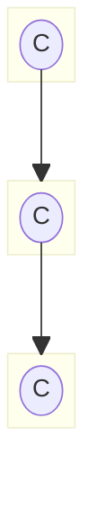

</div></div>

---

## Layering

A $c_i$ with $l_i$
- Provides interface used by $c_k$ where $l_k = l_i + 1$
- Impacted by logic/failures in $c_j$ where $l_j < l_i$

Constrain complexity:
- Each layer considers abstractions only at next layer
- Each layer abstracts over abstractions in next layer

-v-

- ["The structure of the “THE”-multiprogramming system"](https://dl.acm.org/doi/10.1145/800001.811672) by Dijkstra

---

## Layering Generalization

<div class="multicolumn">
<div>

$c_i$ *only* invokes functions in $c_j$ where

$$
l_j = l_i - 1 \vee l_j = l_i
$$

Trade-offs?

</div>
<div>

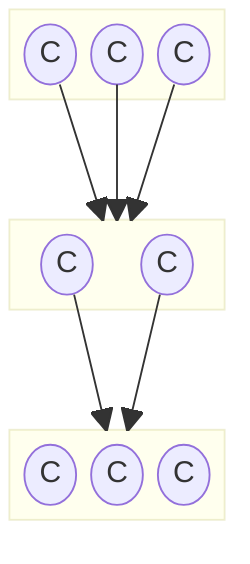

</div></div>

---

## Layering + Passthrough

<div class="multicolumn">
<div>

Allow invocation of components in *any lower level*:
- $c_i$ *only* invokes functions in $c_j$ where $l_j \leq l_i$

Trade-offs?

</div>
<div>

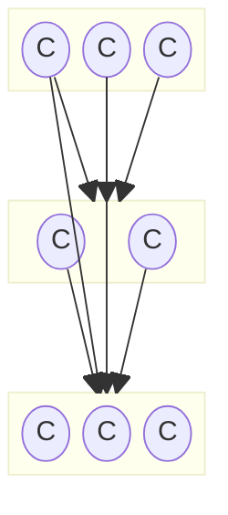

</div></div>

---

## Layering Examples???


---

## Layering Examples

<div class="multicolumn">
<div>

Relatively common
- *Complexity*: Each layer implemented for the abstractions at lower-layers
- *Faults*: Each layer must "trust" the layers below to work correctly

</div>
<div>

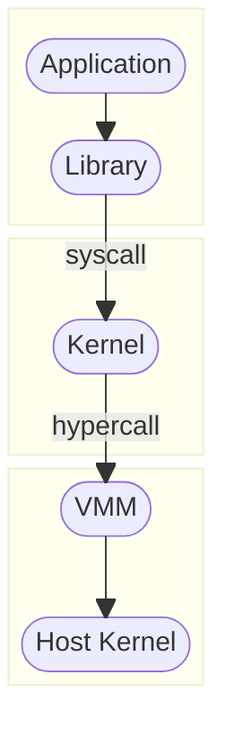

</div>
</div>

---

## Deep Components w/ Layers

<div class="multicolumn">
<div>

Layering within monoliths
- Manage complexity
- Abstraction tower
- Discipline through code-review

</div>
<div>

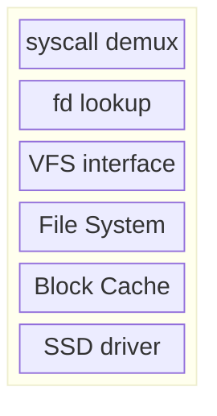

</div>
</div>

---

## Deep Components w/ Layers

<div class="multicolumn">
<div>

Layering within monoliths
- Manage complexity
- Abstraction tower
- "Tech stack"

</div>
<div>

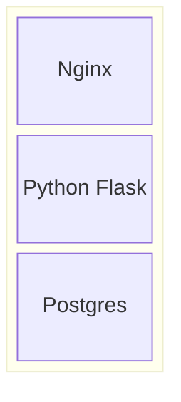

</div>
</div>

---

## Layering Trade-offs

:+1: Strong organization of components, constrain complexity

:-1: Downsides
- Multiple applications might require different abstractions
- Little isolation between applications/users
- Unrelated abstractions don't fit into levels
  - Which should be in higher/lower layers: Networking or Filesystem

:question: What other options do we have?

---

## :two: Hierarchy

<div class="center">

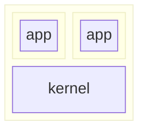

</div>

---

## Hierarchy

<div class="center">

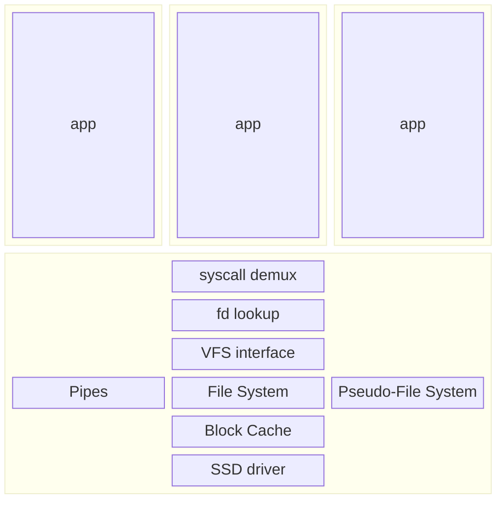

</div>

---

## Hierarchy

<div class="multicolumn">
<div>

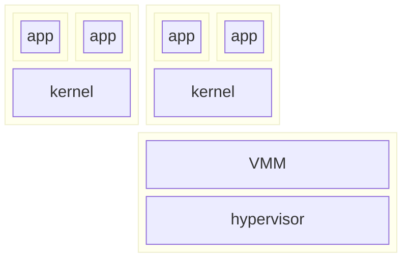

</div><div>

What if we had a VMM per VM?
- What properties of the system does that change?

</div></div>

---

## Hierarchy

<div class="multicolumn">
<div>

Tree-like structure system around per-principal layers enabling principal-centric abstraction.

Often paired with *isolation* facilities
- $c_i$ can only communicate with its associated layers

</div><div>

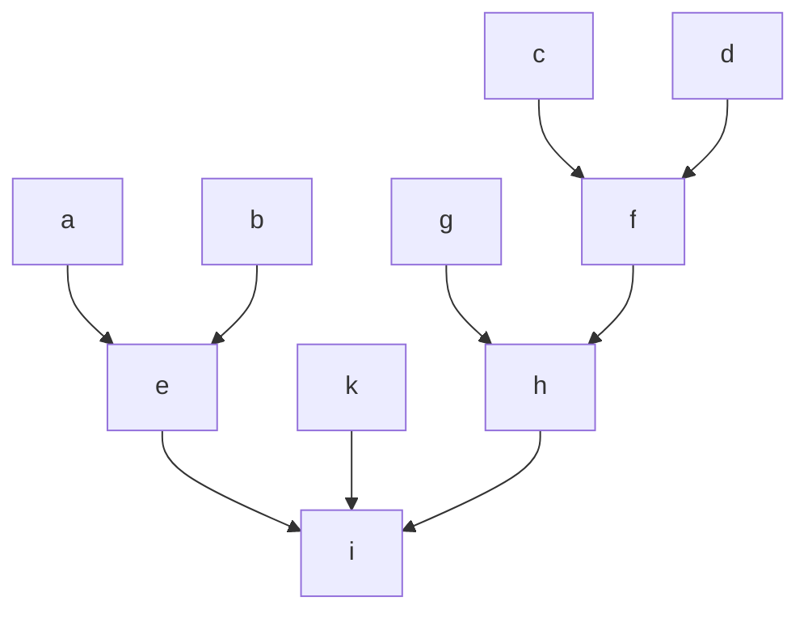

</div></div>

---

## Hierarchy - Specialization

<div class="multicolumn">
<div>

Principal's abstractions customized and principal-specific
- Linux VM vs. Windows VM
- Qemu vs. Firecracker

Your app w/ your libs in docker in VM in VMM in host

</div><div>

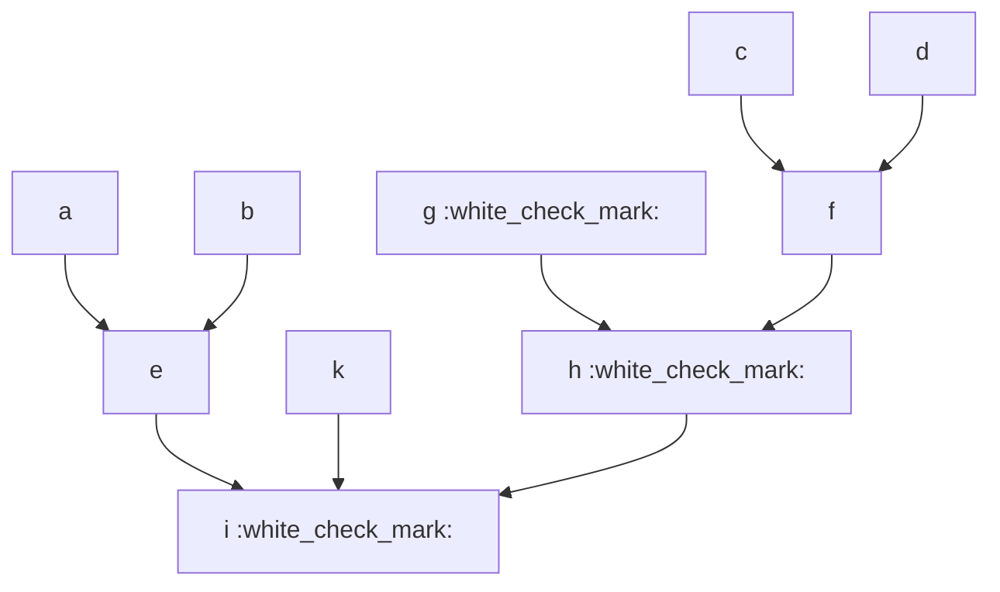

</div></div>

-v-

- *Principles of Computer System Design*, Saltzer & Kaashoek
- *Hints and Principles for Computer System Design*, Lampson

---

##  Hierarchy - Trade-offs

<div class="multicolumn">
<div>

:one: vs :two: vs :three:
- Abstraction properties?
- Isolation properties?

</div><div>

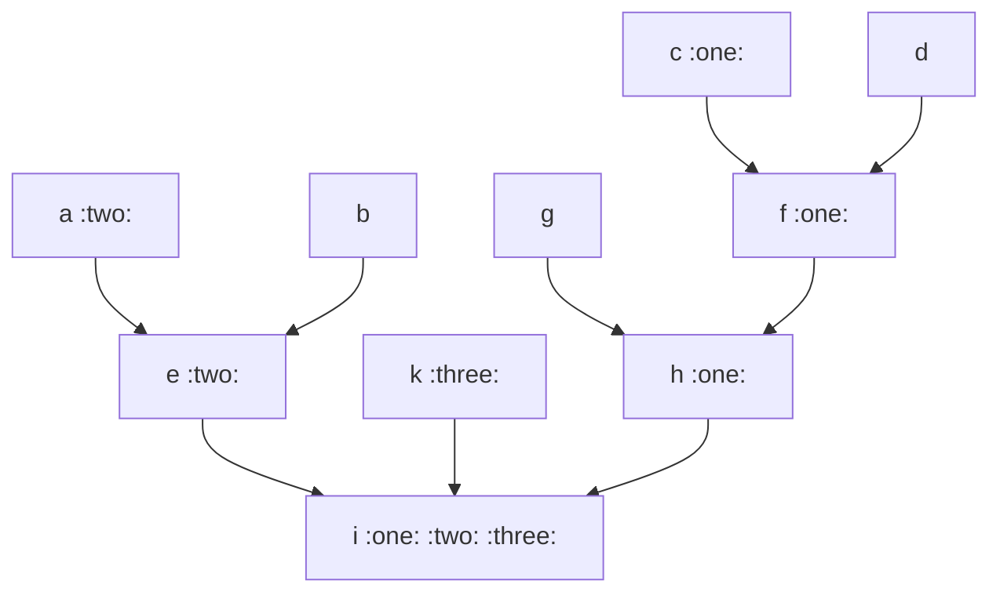

</div></div>

Notes:
- :one: `c` is within a more abstract environment, provided by layers below it, and, all things being equal, will be more isolated given the more abstracted access to resources.
- :three: `k` has more direct access to system resources as the abstractions it accesses are more shallow. This will enable less of a semantic gap, but might have an impact on isolation properties.
- :two: somewhere in-between.

---

## Hierarchy - Trade-offs

<div class="multicolumn">
<div>

:one: vs :two: vs :three:
- Abstraction properties?
- Isolation properties?

</div><div>

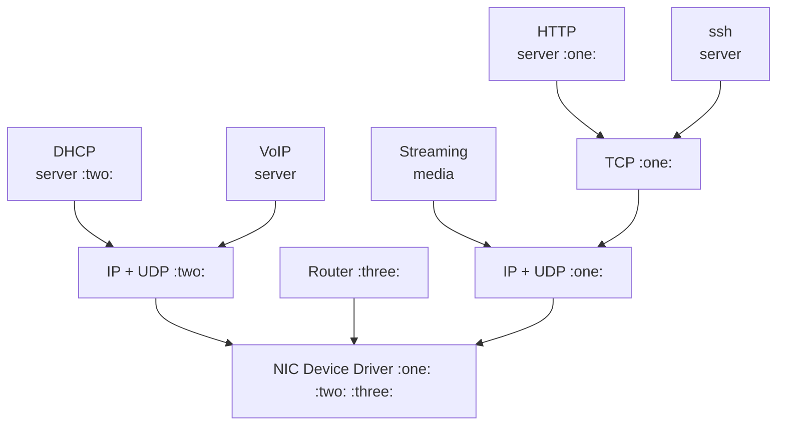

</div></div>

---

## Hierarchy Downsides

- Challenging interactions between different tree branches
  - *deduplication* avoids memory copies
  - fast inter-VM communication
- What "layer" of hierarchy is right for an app?
  - Router: relatively direct access to NIC
  - HTTP server: desires significant
- Components with multiple "children" must provide resource isolation
- Same layering downsides - Unrelated abstractions don't fit into levels (net vs. FS)

---

## Hierarchy Trade-offs

| Layers | Hierarchy | Issue |
|--------------------|--------------------|---------------------------------------------------|
| :white_check_mark: | :white_check_mark: | Constrain complexity       |
| :white_check_mark: | :warning:           | Easy resource sharing (across subtrees)           |
| :white_check_mark: | :warning:           | No resource isolation       |
| :x:           | :white_check_mark: | Application (subtree) isolation         |
| :x:           | :white_check_mark: | Appllication (subtree) abstraction specialization |
| :x:           | :x:           | Avoid strict ordering of abstractions             |

---

# System as DAG of Components

---

## Components

<div class="multicolumn">
<div>

**Component**
- *Interface(s)*
- *Implementation*
- *Dependencies* on other Interfaces

</div><div>

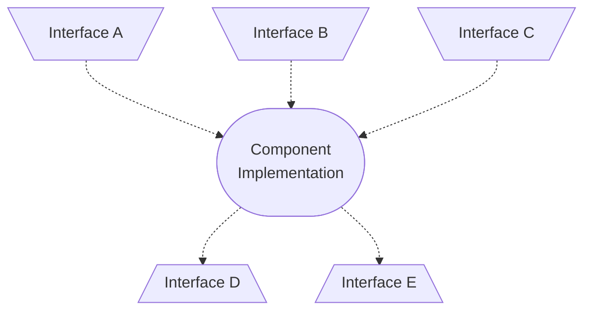

</div></div>

---

## Component Dependencies

<div class="center">

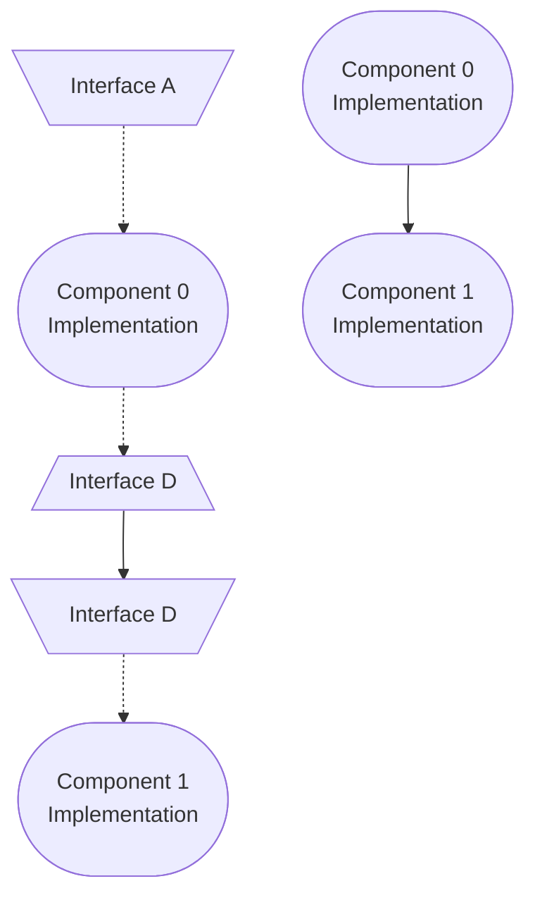

</div>

---

## System as Components

<div class="multicolumn">
<div>

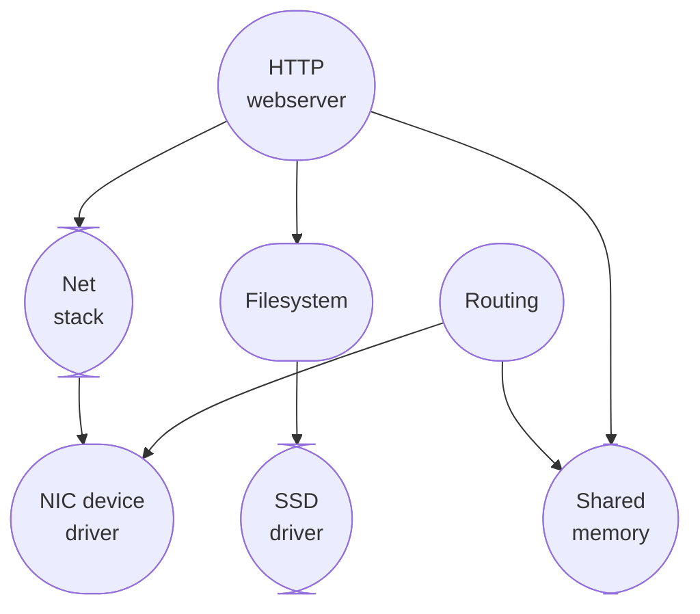

</div><div>

- Explicit sharing (e.g. shared memory)
- No artificial layering (DAG)

</div></div>

---


---
