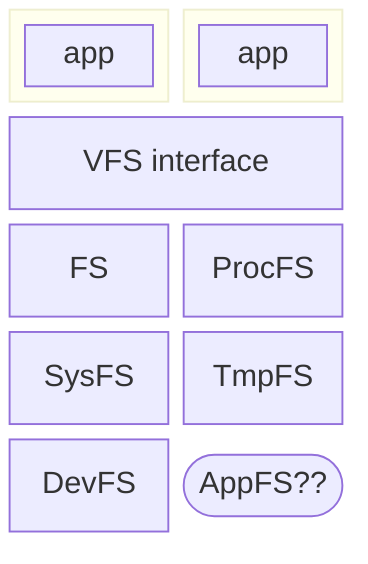
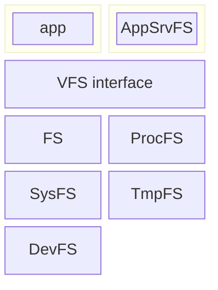
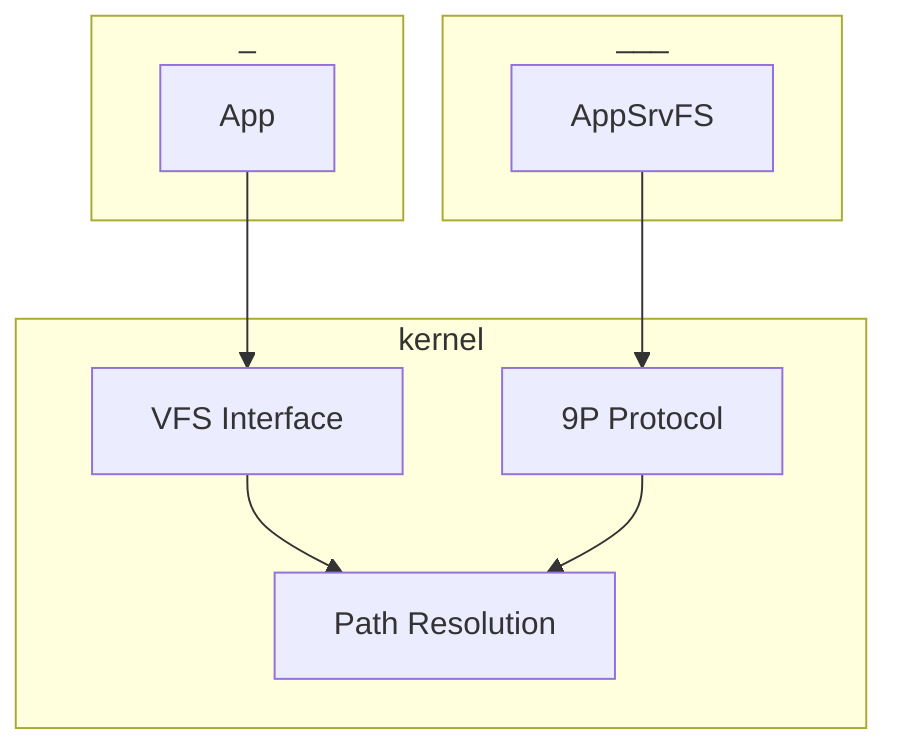
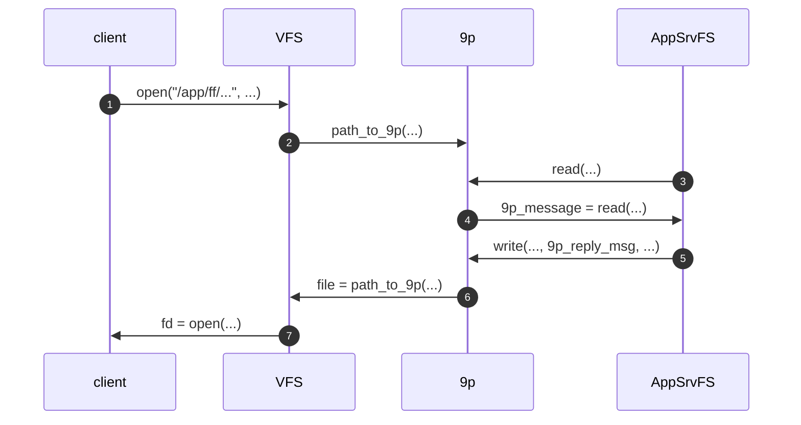
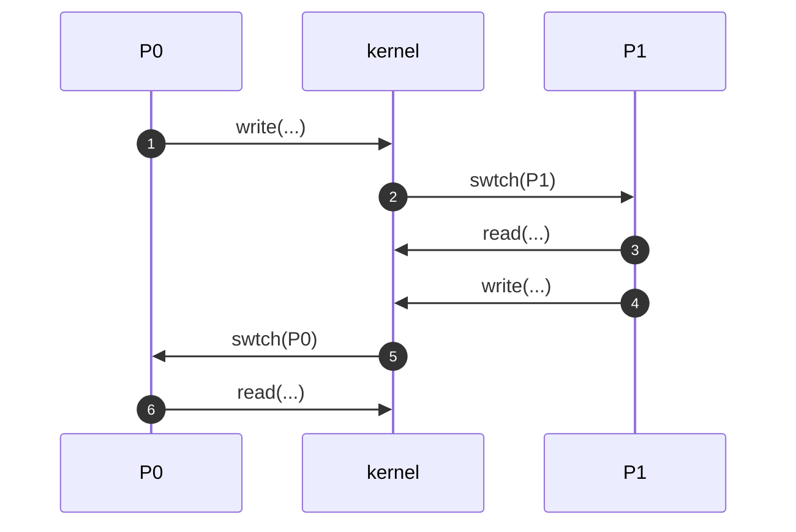
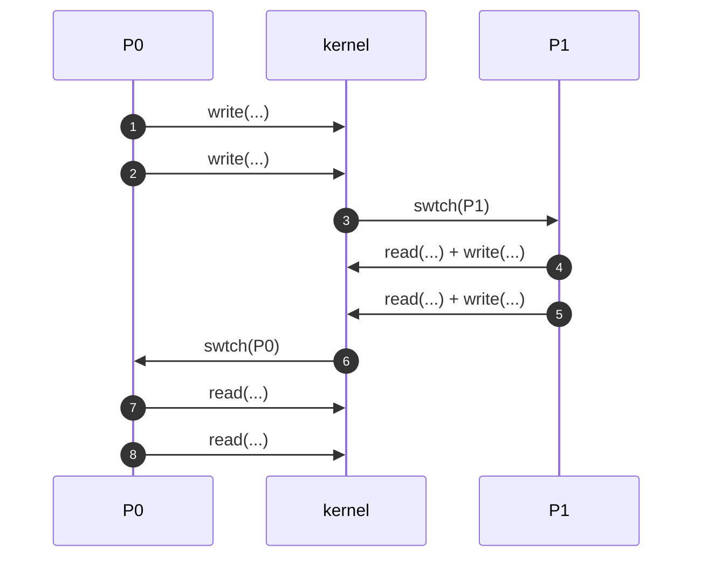
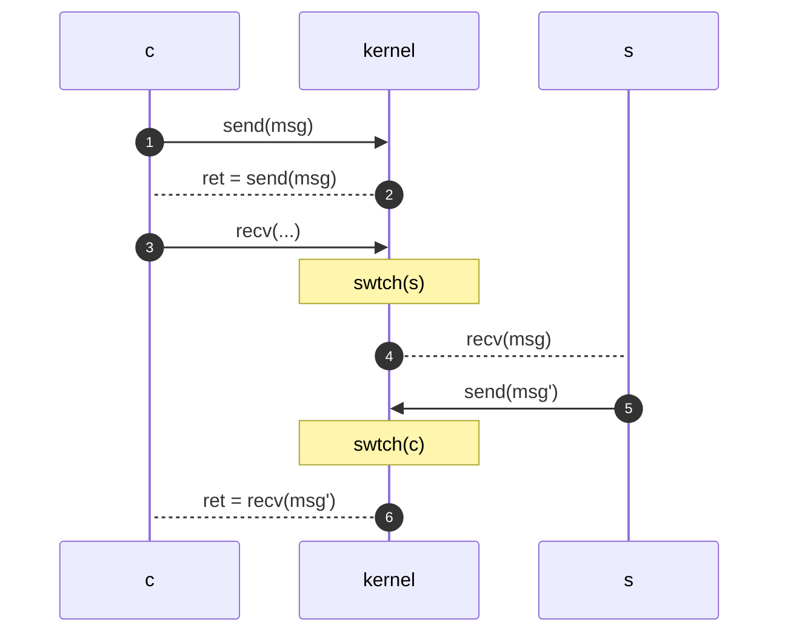
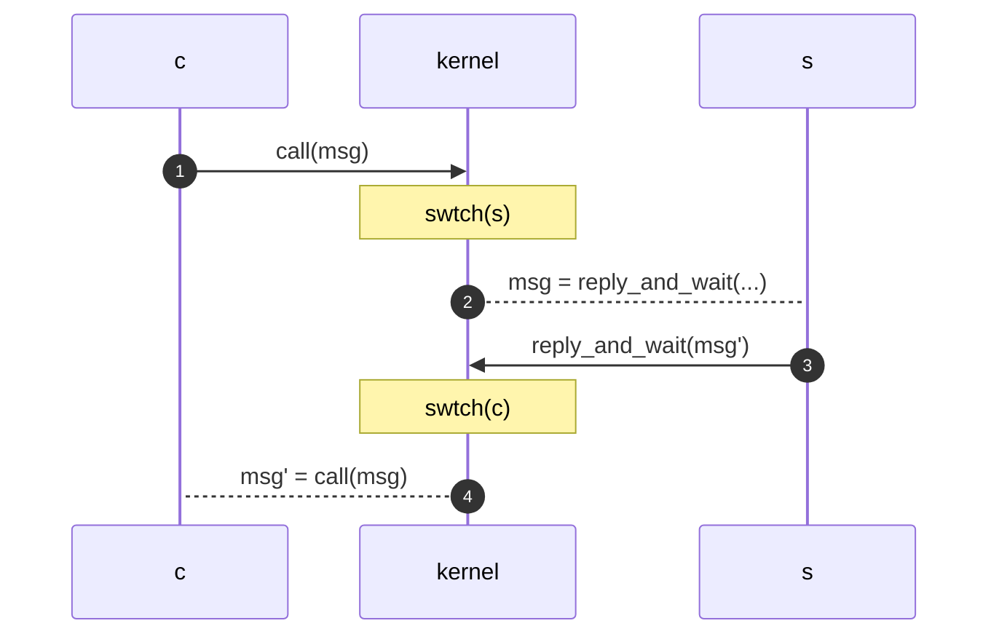
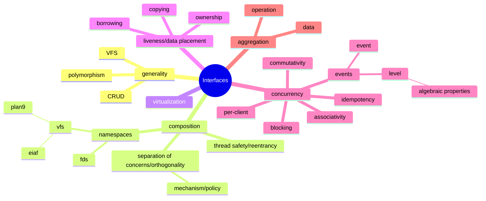

# Interface Properties

<div class="center">

**Gabe Parmer**

© Gabe Parmer, 2025, All rights reserved

</div>

---

## Interface Design

How can we think about interface design?

---

## Generality vs. Specificity

General, thin interfaces can be polymorphic
- Multiple implementations
- Component dependencies are on *interfaces*

Techniques
- Identify resources with (hierarchical) strings
- Decouple resource resolution from access (path vs. fd)
- Operations: access/modify/delete/create resource

-v-

- The [Liskov substitution principal](https://en.wikipedia.org/wiki/Liskov_substitution_principle) provides the foundation for how we might think about polymorphism independent of any specific language.


---

## General Interface Examples

Virtual File System API (VFS) and/or [9P](http://man.cat-v.org/plan_9/5/intro)
- OPs: open, read, write, close, creat, unlink, lseek, ...
- Polymorphic: pipe, file, socket, ...

[CRUD](https://en.wikipedia.org/wiki/Create,_read,_update_and_delete) (create, read, update, delete)/REST
- OPs: GET, PUT, DELETE, POST, PATCH
- Polymorphic: cached, static webpage, dynamic webpage

---

# Abstraction Composition

---

## Function Composition

Given functions $f$ and $g$, and arguments $a$ and $a'$:
- Each function has an expected behavior
- Is that expected behavior maintained, when executed in sequence?

$f(a); g(a')$?

---

Does `strtok` compose with itself?

```c [1-3|5-9|10-17|10-25]
/* Find strings that are space-delimited*/
s1 = strtok(str, " ");
s2 = strtok(NULL, " ");

/* What about if we add another operation in-between? */
s1 = strtok(str, " ");
s3 = strtok(str2, " ");
s2 = strtok(NULL, " ");

/* How could this happen? */
void
parse(void)
{
	s1 = strtok(str, " ");
	foo();
	s2 = strtok(NULL, " ");
}

void
foo(void)
{
	/* ... */
	s3 = strtok(str2, " ");
	/* ... */
}
```

---

Contrast this with `strtok_r`

```c []
char *saved_position = NULL;
s1 = strtok_r(str, " ", &saved_position);
s3 = strtok(str2, " ");
s2 = strtok_r(NULL, " ", &saved_position);
```

---

## Composition: Locks Don't Compose

```c [1-19|22-23|26-35|37-41|43-51|53-66]
void
dec(struct account *a, int amnt)
{
	lock_take(&a->l);
	a->balance -= amnt;
	lock_release(&a->l);
}

void
inc(struct account *a, int amnt)
{
	lock_take(&a->l);
	a->balance += amnt;
	lock_release(&a->l);
}

inc(a, 10); /* correct */
/* ... */
dec(a, 10); /* correct */

/* transfer between accounts */
dec(a, 10);
inc(b, 10);
/* not necessarily correct */

void
transfer(struct account *from, *to, int amnt)
{
	lock_take(&from->l);
	lock_take(&to->l);
	to->balance += amnt;
	from->balance -= amnt;
	lock_release(&to->l);
	lock_release(&from->l);
}

/* thread 1 */
transfer(a, b, 10);
/* thread 2 */
transfer(b, a, 10);
/* potential deadlock! */

void
transfer_not_scalable(struct account *from, *to, int amnt)
{
	/* Not scalable! Single coarse-grained global lock, used everywhere */
	lock_take(&accounts->l);
	to->balance += amnt;
	from->balance -= amnt;
	lock_release(&accounts->l);
}

void
transfer_complex(struct account *from, *to, int amnt)
{
	/* lock ordering by address */
	struct account *min = MIN(from, to);
	struct account *max = MAX(from, to);

	lock_take(&min->l);
	lock_take(&max->l);
	to->balance += amnt;
	from->balance -= amnt;
	lock_release(&max->l);
	lock_release(&min->l);
}


```

-v-

Locks are not composable, and transactional memory was proposed as a solution. [Beautiful concurrency](https://www.microsoft.com/en-us/research/wp-content/uploads/2016/02/beautiful.pdf) in Haskell discusses a software transactional memory approach.

---

## Composability vs. "The Right Thing"

Recursive locks have an interface that self-composes:
- Can you take a taken lock?
- `lock(&l); lock(&l); cs(); unlock(&l); unlock(&l);`

Easier to use:
- Functions can take whatever lock is relevant

Interfaces shouldn't encourage "bad behavior":
- There are [many](http://www.fieryrobot.com/blog/2008/10/14/recursive-locks-will-kill-you/) [arguments](http://www.zaval.org/resources/library/butenhof1.html) [against](https://blog.stephencleary.com/2013/04/recursive-re-entrant-locks.html) [them](https://inessential.com/2013/09/24/recursive_locks).

---

## Composition: `fork`

`fork` - create new process, copying current process' state

`fork` doesn't compose with the following...*why*?
- `pthread_create`/`pthread_mutex_lock` - thread creation and locking
- `printf` - without a `\n` in the string, nor a `fflush`
- `exec` - does the composition have strong performance?

fork exposes leaky abstractions! <!-- .element: class="fragment" data-fragment-index="3" -->

Notes:
- If a thread is accessing a locked data-structure, and another thread calls `fork`, the data-structure will be left inconsistent.
- Buffered I/O suffers from the buffered output being replicated in `fork`
- `exec` must be called immediately, and all memory is replaced immediately after being copied

-v-

`fork` is [really not great](https://dl.acm.org/doi/10.1145/3317550.3321435). `posix_spawn` and the like are cleaner APIs.

---

## Considerations for Composability

*Thread safety*
- Does the interface allow two threads to call functions in an interface?
- In other words: are locks and other facilities used correctly?

*Reentrancy*
- Will an implementation provide proper service if a signal triggers during its execution?
- What if the signal handler calls the component?

---

## Considerations for Composability

Reentrancy problem examples:
- What if we call `malloc` in a signal handler?
- Call buffered I/O (e.g. `printf`)?

If your interface is not thread safe and reentrant, you are *not* composable with threads nor signals.
- I'd argue to *not use signals* and "give up" on that game (there are alternatives).

Notes:
`malloc` requires locks, so if we get a signal handler while holding one of these locks, then call `malloc`, we'll take the lock a second time and, more importantly, try and access data-structures currently in a critical section.
Not good.

Similar, what if are in the middle of flushing the buffered I/O for `printf` when a signal triggers, and calls `printf` -- thus trying to flush the buffer that is already being flushed.
This will likely result in redundant output.
Note, this applies to any buffered I/O, not just to stdout.

Signal alternatives: use signals, but just have them write to a FD hooked to a pipe to send an event to the main event loop.
Or in Linux, use `signalfd`.

---

## Goal: Composability

Simple systems, complex behavior:
- Independent functions, composed to create complex behavior

UNIX commands:
- Programs with text-based input/output, composed with `|`
- `$ cat classlist | grep "gwu.edu" | wc -l` - how many students in class?

---

# Considerations for Composability

---

## Namespaces and Composability

If we have $N$ different namespaces, then interfaces speak different languages
- It is harder for functions to be composable
- They don't have the ability to consistently name resources

---

## Composability via VFS

Linux unifies interfaces around `fd`s:
- [`pidfd`](https://man7.org/linux/man-pages/man2/pidfd_open.2.html)
- [`timerfd`](https://man7.org/linux/man-pages/man2/timerfd_create.2.html)
- [`signalfd`](https://man7.org/linux/man-pages/man2/signalfd.2.html)
- [`eventfd`](https://man7.org/linux/man-pages/man2/eventfd.2.html)
- [`memfd`](https://man7.org/linux/man-pages/man2/memfd_create.2.html) (vs. tmpfs)
- [`userfaultfd`](https://man7.org/linux/man-pages/man2/userfaultfd.2.html)
- [`setns`](https://man7.org/linux/man-pages/man2/setns.2.html) to update the namespaces

Why do we want all of these that used to be different interfaces?

Notes:

- `pidfd`? How do we wait for a file to have activity and for a child process to terminate?
- Integrate all of these fds into the event loop of the application

Namespace manipulations
- Update root w/ [pivot_root](https://man7.org/linux/man-pages/man2/pivot_root.2.html)
- [`clone`](https://man7.org/linux/man-pages/man2/clone.2.html) to control what is shared upon creating a new process
- [`unshare`](https://man7.org/linux/man-pages/man2/unshare.2.html) to remove shared resources

References many resources via fds
- [`pidfd`](https://man7.org/linux/man-pages/man2/pidfd_open.2.html) Why? How do we wait for a file to have activity and for a child process to terminate?
- [`timerfd`](https://man7.org/linux/man-pages/man2/timerfd_create.2.html)
- [`signalfd`](https://man7.org/linux/man-pages/man2/signalfd.2.html)
- [`eventfd`](https://man7.org/linux/man-pages/man2/eventfd.2.html)
- [`memfd`](https://man7.org/linux/man-pages/man2/memfd_create.2.html) (vs tmpfs in /tmp/) memfd’s transient use without an entry in the FS namespace means it can be better for [storing secrets](https://benjamintoll.com/2022/08/21/on-memfd_create/)
- [`userfaultfd`](https://man7.org/linux/man-pages/man2/userfaultfd.2.html)
- Even the function to set the namespace to be used [`setns`](https://man7.org/linux/man-pages/man2/setns.2.html) does so using fds that reference namespace files in a processes’ /proc entries…

---

## Composability via VFS

Unifying the namespace of kernel resources
- ensures consistent access to all resources
- ...but often uses bit-formats (i.e. `struct`s) that are `read`/`written`.

In contrast, plan9 uses a uniform textual representation
- no `socket`, `bind`, `connect`, ... instead:
  - `echo "connect 2048" /net/tcp/2/ctl` to set who can connect to the second process' socket
  - `cat /net/tcp/2/data` to read packets

---

## Composability via Hierarchical Namespace

- `/proc/*/*` - normal programs uniformly access kernel process state
- `/sys/*` - normal programs uniformly access kernel system configuration
- [`setns`](https://man7.org/linux/man-pages/man2/setns.2.html) updates the namespace of a process, and often requires passing a `fd` to a namespace file in the `/proc` FS.

Using hierarchical FS namespace as a *program abstraction*:
- the [`acme`](https://www.youtube.com/watch?v=dP1xVpMPn8M) editor
- the [plumber](http://9p.io/sys/doc/plumb.html) for expressive system messaging

---

## Everything is a File

In Plan 9, this is very much true.
- uniform representation of resources in the hierarchical namespace
- accessed via the small set of VFS functions
- Example: plan9 networking

---

```[]
cpu% cd /net/tcp/2

cpu% ls -l
--rw-rw---- I 0 ehg    bootes 0 Jul 13 21:14 ctl
--rw-rw---- I 0 ehg    bootes 0 Jul 13 21:14 data
--rw-rw---- I 0 ehg    bootes 0 Jul 13 21:14 listen
--r--r--r-- I 0 bootes bootes 0 Jul 13 21:14 local
--r--r--r-- I 0 bootes bootes 0 Jul 13 21:14 remote
--r--r--r-- I 0 bootes bootes 0 Jul 13 21:14 status

cpu% cat local remote status

135.104.9.31 5012

135.104.53.11 564

tcp/2 1 Established connect
```

-v-

- [Plan 9 videos](https://www.youtube.com/@adventuresin9/videos)
- [Namespaces in Plan9](https://doc.cat-v.org/plan_9/4th_edition/papers/names)
- [Networking in plan9](https://doc.cat-v.org/plan_9/4th_edition/papers/net/)
- [Implementation and namespaces in plan9](https://doc.cat-v.org/plan_9/4th_edition/papers/9)

---

## Plan 9 EIAF

What if any application can expose a VFS API to contribute to *full-system composability*?

``` [1|2-5|6]
$ echo "home https://faculty.cs.gwu.edu/gparmer/pubs.html" > /apps/firefox/newtab
$ cat /apps/firefox/home/ul/li/span/contents | head -n 3
Edge-RT: OS Support for Controlled Latency in the Multi-Tenant, Real-Time Edge
SBIs: Application Access to Safe, Baremetal Interrupt Latencies
The Thundering Herd: Amplifying Kernel Interference to Attack Response Times
$ echo "<li>Gabriel Parmer, <span class="text-info">MY NEW PAPER</span></li>" >> /apps/firefox/home/ul/content
```

---

## Implement App EIAF in Linux



---

## Implement App EIAF in Plan 9

<div class="multicolumn"><div>



</div><div>



</div></div>

---

## Plan 9 Interactions



---

## Benefits - Composability

Want to add features to your browser?

Chrome/Firefox:
1. Hack on a >1M SLoC codebase
2. Browser plugin model
   - Javascript + 100s of APIs

Plan 9 or Linux w/ FUSE:
- User: command line
- Extensions: programs w/ VFS calls

---

## Separation of Concerns/Orthogonality

Different *functions or components* should
- perform *non-overlapping changes* to the system, and/or
- provide *non-overlapping abstractions*.

> Do one thing well.
> - Doug McIlroy

*Why???*

-v-

- [Separation of concerns](https://en.wikipedia.org/wiki/Separation_of_concerns) (SoC)
- [Orthogonality](http://www.catb.org/~esr/writings/taoup/html/ch04s02.html#orthogonality)

---

## Separation of Concerns/Orthogonality

Why?

1. Redundant code
2. Complexity in interactions between implementations
3. Stratification of clients across APIs
4. *Decreased composability*

---

## Examples: Not Orthogonal

| Abstraction | Implementations |
|-------------|-----------------|
| Linux IPC | signals, pipes, System V Shared Memory, mapped files, shared files, named pipes, UNIX domain sockets, TCP/UDP sockets, DBus, Binder|
| File access | `mmap`, `read`, `readv`, `pread`, `fread`|
| Processes | `clone`, `fork`, `vfork`, `posix_spawn`|
| Event management | `poll`, `select`, `epoll`, `io_uring`, signals |

---

## Separation of Mechanism and Policy

> The identification of a piece of software as "policy" or "mechanism" is a relative one. The implementor of a (virtual) resource establishes policies for the use of that resource; such policies are implemented with mechanisms provided by external software.
> Thus a hierarchy exists (under the relation "is implemented using") in which higher-level software views higher-level facilities as mechanisms.
> - Levin et al.

-v-

- [Mechanism/Policy Separation in Hydra](https://dl.acm.org/doi/10.1145/800213.806531) by Levin et al.

---

## Separation of Mechanism and Policy

A perspective on dependencies

- What mechanisms is my abstraction providing to its clients?
  - often: what is the resource and its properites?
- What are the policies it wishes to enable?
  - how are resources to be used?
- Policies determine how to deploy and use the resource

---

## Separation of Mechanisms and Policy

| Mechanism | Policy |
|-----------|--------|
| UNIX Syscalls | Shell |
| Shell | Pipelines |
| X-Windows | Chrome |
| Atomic instructions | locks |
| Interrupts | Premptive Scheduling |

---

## Mech/Policy: Semantic Gap/Leaky abstractions

The *semantic gap* for an abstraction/policy can often be bypassed by instead using the mechanism of the underlying component.

*Leaky abstractions* can be avoided by a component *not* providing functionality beyond what is natural for the abstraction - instead enabling clients to talk to the underlying mechanism.

**But**...doing so often comes at the cost of composability.

---

## Contradictions

> KISS: Keep it Simple, Stupid. Don't Generalize

- "Hints and Priniciples for Computer System Design", [Lampson](https://arxiv.org/pdf/2011.02455)

> "unnecessary specialization...is a significant contributor to software complexity"

- "Philosophy of Software Design", Ousterhout

---

## Powerful Interfaces and Components

**Composability**: Combine mechanisms $\to$ powerful policies

**Orthogonality**: Make interfaces easier to combine

**Mechanism/Policy**: Intentionally design the dependencies

---

## Virtualization

Virtualizing an interface
- Providing an interface $A$ similar to another $A'$
- ...where $A'$ depends on $A$
- ...thus providing a higher-level abstraction
- Example: VMs vs. hardware

Virtualizing a resource
- Provide a more abstract version of that resource
- CPU $\to$ thread
- physical memory$\to$virtual memory
- interrupt$\to$signal

---

## Virtualization

Virtual resource namespace
- Separate namespace for virtualized resources
- Component providing virtualization: $m(r_v)\to r_p$

Examples:
- Virt Mem: page-tables virtualize phys mem
- VMs:
  - virt phys mem w/ extended page-tables
  - virt cores: vCPUs
- Containers: virt all namespaces
  - FS: new `/` to FS

---

## Liveness and Data Placement in Interfaces

*Liveness* - Who is in charge of freeing a resource?
- who is the *owner* of the resource?
- who *borrows* a resource during a call?

*Data placement* - When data addresses are passed between components,
- what names (addresses) are used,
- who allocates the names, and
- who has access to the names?

---

## Liveness/Data Placement in Interfaces

Implicit in *every C interface*

:one: Client allocates, server borrows
```c []
char *buf = malloc(BUFSZ);
server_fn(buf, BUFSZ);
free(buf);
```
Client determines data location.

---

## Liveness/Data Placement in Interfaces

:two: Client allocates, passes ownership to server
```c []
char *buf = malloc(BUFSZ);
server_fn(buf, BUFSZ);
```
Client determines data location.

---

## Liveness/Data Placement in Interfaces

:three: Server allocates, passes ownership to client
```c []
char *buf;
int sz;
server_fn(&buf, &sz);
free(buf);
```
Server determines data location.

---

```c [1,2|1,3-9]
/* :one: Client allocates, provites data location, kernel borrows */
ssize_t read(int fd, void *buf, size_t count);
ssize_t writev(int fd, const struct iovec *iov, int iovcnt);
char *str = "hello world\n";
ssize_t nwritten;
struct iovec iov[1];
iov[0].iov_base = str;
iov[0].iov_len = strlen(str);
nwritten = writev(STDOUT_FILENO, iov, 1);
```

---

```c++ [2,5|3,5-14|11]
/* :three: Server allocates, passes ownership to client */
int dmtr::io_queue_api::pop(dmtr_qtoken_t &qtok_out, int qd);
int dmtr::io_queue_api::poll(dmtr_qresult_t &qr_out, dmtr_qtoken_t qt);
/* where ... */
typedef uint64_t dmtr_qtoken_t;
typedef struct dmtr_qresult {
    enum dmtr_opcode qr_opcode;
    int qr_qd;
    dmtr_qtoken_t qr_qt;
    union {
        dmtr_sgarray_t sga;
        dmtr_accept_result_t ares;
    } qr_value;
} dmtr_qresult_t;
```

-v-

From the [demikernel](https://www.microsoft.com/en-us/research/project/demikernel/) [source](https://github.com/gwu-cs-advos/demikernel) and these examples from the [types](https://github.com/gwu-cs-advos/demikernel/blob/master/include/dmtr/types.h).

---

## Shared Memory Allocation

:one:, :two:, and :three: across isolated components?

---

## Shared Memory Allocation

[Shared memory w/ bitmap allocation](https://github.com/gwsystems/composite/blob/main/src/components/lib/shm_bm/doc.md) in [Composite](https://github.com/gwsystems/composite/)
- slab allocator in shared memory
- Memory object references that can be shared across memory virtual address spaces
- namespace:
  - `shm_bm_t` - the shared memory pool allocated from
  - `shm_objid_t` - the object id within a specific pool

---

# Concurrency

---

## Concurrency in Implementations

Component state relevant for $c_i$ can be updated by
1. client requests from $c_i$,
2. client requests from $c_j, i \neq j$, and/or
3. interactions with lower-level (server) components.

---

## Concurrency in Implementations

Mechanisms:
- *Correctness* - locks, lock-free data-structures
- *Thread interactions* - condition variables, semaphores

---

```c [1-34|13,26|11,18|13-16|26-29]
mutex_t lock = MUTEX_INIT;
condvar_t cv = CV_INIT;
volatile int awaiting_value = 0;
struct hash_table ht;

value_t
kv_get(key_t k)
{
	value_t v = VALUE_NULL;

	mutex_lock(&lock);
	while (1) {
		v = ht_get(&ht, k);
		if (v != VALUE_NULL) break;
		awaiting_value = 1;
		condvar_wait(&cv, &lock);
	}
	mutex_unlock(&lock);

	return v;
}

kv_put(key_t k, value_t v)
{
	mutex_lock(&lock);
	ht_put(&ht, k, v);
	if (awaiting_value) {
		awaiting_value = 0;
		condvar_signal_broadcast(&cv);
	}
	mutex_unlock(&lock);

	return v;
}
```

---

## Concurrency in Implementations

Implementation must consider:
- different clients don't want to trust each other - horizontal isolation
- avoid cross-client blocking/progress?
- avoid cross-client serialization/lock delays?
- shared namespaces/shared resources makes this hard
  - example with separate namespaces

---

```c [1-10|16|18-25]
struct client_data {
	mutex_t lock;
	condvar_t cv;
	volatile int awaiting_value;
	struct hash_table ht;
} clients[CLIENT_NUM];
/*
 * We're "cheating" here as we know we can
 * access `clients` without a lock to simplify.
 */

value_t
kv_get(key_t k)
{
	value_t v = VALUE_NULL;
	struct client_data *c = clients[client_id()];

	mutex_lock(&c->lock);
	while (1) {
		v = ht_get(&c->ht, k);
		if (v != VALUE_NULL) break;
		c->awaiting_value = 1;
		condvar_wait(&c->cv, &c->lock);
	}
	mutex_unlock(&c->lock);

	return v;
}

void
kv_put(key_t k, value_t v)
{
	struct client_data *c = clients[client_id()];

	mutex_lock(&c->lock);
	ht_put(&c->ht, k, v);
	if (c->awaiting_value) {
		c->awaiting_value = 0;
		condvar_signal_broadcast(&c->cv);
	}
	mutex_unlock(&c->lock);

	return v;
}
```

---

## Blocking vs. Non-blocking

Can a thread *block* when it invokes an interface in a function?
1. Block on a lock?
   So long as it is a lock with *progress guarantees*, we don't count this as "blocking".
2. Can the thread block awaiting some more complicated event, potentially forever!

---

## Blocking vs. Non-blocking

Blocking:
- *requires* multi-threaded client code if it wants to efficiently work with multiple (blocking) resources.
- Terse and simple if only working with a single resource.

Non-blocking:
- Returns immediately, even if operation cannot be performed yet.
- Degenerates into active polling.

What are the bad execution scenarios in the following?

---

```c [2-10|13-20|1-20]
/* What are the bad execution scenarios in each of the following? */

int
blocking(res_t r1, res_t r2)
{
	while (1) {
		blocking_operation(r1);
		blocking_operation(r2);
	}
}


int
nonblocking(res_t r1, res_t r2)
{
	while (1) {
		nonblocking_operation(r1);
		nonblocking_operation(r2);
	}
}
```

---

## Concurrency in Interfaces: Events

- Is a function potentially *blocking*?
- Does a thread block on a specific resource?
- What **events** trigger the unblocking/waking on a resource?

Generally:
- What **events** does a component define?
- What *triggers* those **events**?
- How does how does one *await* (or block on) an **event**?

---

## Event Aggregation

Concurrent server (`nginx`):
- Want to await an event on *any* client's socket
- Can't block on a single client's socket

Primitives: `epoll`/`poll`/`select`
- await an event on *at least one* of a *set* of events
- return the *set of triggered events*

---

## KV Store + Events

We want to
1. associate an event with a resource (a `value`), and
2. trigger the event when there is an *update* on the value.

Challenge:
- `kv_put` *transparently* creates a value
- How do we know when/if we associate an event with it?
- Orthogonality$\to$ `kv_add` & `kv_update`

---

```c [1-4|6-7|31-38|45,57|70-81|89-91]
/* Client APIs */
evt_t evt_create(void *data);
void evt_delete(evt_t e);
evt_t *evt_await(evt_t grp, evt_prop_t p);

/* Server API */
int evt_trigger(evt_t e, evt_prop_t p);

/* Server component, extending the key-value store */
value_t
kv_get(key_t k)
{
	value_t v = VALUE_NULL;
	struct client_data *c = clients[client_id()];

	mutex_lock(&c->lock);
	val = ht_get(&c->ht, k);
	if (val) v = val->v;
	mutex_unlock(&c->lock);

	return v;
}

int
kv_add(key_t k, value_t v, evt_t e)
{
	struct client_data *c = clients[client_id()];
	struct val *val;

	mutex_lock(&c->lock);
	val = ht_get(&c->ht, k);
	if (val) {
		mutex_unlock(&c->lock);
		return -1;
	}
	val = malloc(sizeof(struct val));
	*val = (struct val) { .v = v, .e = e };
	ht_put(&c->ht, k, val);
	mutex_unlock(&c->lock);

	return 0;
}

int
kv_update(key_t k, value_t v)
{
	struct client_data *c = clients[client_id()];
	struct val *val;
	int ret = -1;

	mutex_lock(&c->lock);
	val = ht_get(&c->ht, k);
	if (val) {
		val->v = v;
		ret = 0;
		/* This is an update event on the value */
		evt_trigger(val->e, EVT_UPDATE);
	}
	mutex_unlock(&c->lock);

	return ret;
}

/* The client */
int
main(void)
{
	evt_t *e1, *e2;

	e1 = evt_create(NULL);
	e2 = evt_create(NULL);

	kv_add(1, 1, e1);
	kv_add(2, 2, e2);

	thread_create(triggering_fn);

	while (1) {
		evt_await(e1);
		printf("progress w/ %lx...", kv_get(1));
	}
}

void
triggering_fn(void)
{
	val_t to_the_moon = 0;

	while (1) {
		kv_update(2, to_the_moon++);
	}
}

```

Notes:
Problem here is that we won't be notified of the event on the *other* resource.

---


```c [4|71-92]
/* Client APIs */
evt_t evt_create(void *data);
void evt_delete(evt_t e);
int evt_group(evt_t grp, evt_t e);
evt_t *evt_await(evt_t grp, evt_prop_t p);

/* Server API */
int evt_trigger(evt_t e, evt_prop_t p);

/* Server component, extending the key-value store */
value_t
kv_get(key_t k)
{
	value_t v = VALUE_NULL;
	struct client_data *c = clients[client_id()];

	mutex_lock(&c->lock);
	val = ht_get(&c->ht, k);
	if (val) v = val->v;
	mutex_unlock(&c->lock);

	return v;
}

int
kv_add(key_t k, value_t v, evt_t e)
{
	struct client_data *c = clients[client_id()];
	struct val *val;

	mutex_lock(&c->lock);
	val = ht_get(&c->ht, k);
	if (val) {
		mutex_unlock(&c->lock);
		return -1;
	}
	val = malloc(sizeof(struct val));
	*val = (struct val) { .v = v, .e = e };
	ht_put(&c->ht, k, val);
	mutex_unlock(&c->lock);

	return 0;
}

int
kv_update(key_t k, value_t v)
{
	struct client_data *c = clients[client_id()];
	struct val *val;
	int ret = -1;

	mutex_lock(&c->lock);
	val = ht_get(&c->ht, k);
	if (val) {
		val->v = v;
		ret = 0;
		/* This is an update event on the value */
		evt_trigger(val->e, EVT_UPDATE);
	}
	mutex_unlock(&c->lock);

	return ret;
}

/* The client */
int
main(void)
{
	evt_t *e1, *e2, *eg;

	/*
	 * When the events trigger, we're having them
	 * return to us thekey associated with the event!
	 */
	e1 = evt_create((void *)1);
	e2 = evt_create((void *)2);
	eg = evt_create(NULL);

	kv_add(1, 1, e1);
	kv_add(2, 2, e2);

	/* the group event tracks the set of other events. */
	evt_group(eg, e1);
	evt_group(eg, e2);

	thread_create(triggering_fn);

	while (1) {
		/* return's the `void *` passed in `evt_create` */
		key_t k = (key_t)evt_await(eg);
		printf("progress w/ %lx...", kv_get(k));
	}
}

void
triggering_fn(void)
{
	val_t to_the_moon = 0;

	while (1) {
		kv_update(2, to_the_moon++);
	}
}


```

Notes:
Now we're waiting on the *group or set of events*, not for a specific resource/event.

---

## Event Interfaces

- *Event-triggered* - tell me when the resource status *changes* (i.e. a value is updated)
- *Level-triggered* - tell me all of the resources in a specific *state*

Level-triggered is *idempotent*, making it easier to write applications
- `select` returns the set of all `fd`s in specific states.

---

## Level- vs. Event-Triggered

Level-triggered (idempotent):
```python []
assert(select(evts) == select(evts))
```

Event-triggered:
```python []
assert(select(evts) != None)
assert(select(evts) = None)
```

Notes:
Event-triggered: once we read out an event, it won't be reported anymore!

Recall, when a function isn't idempotent, we're expecting the client to track state.

---

## Level-Triggered Events

```python []
evts = [e0, e1, ...]

# Event loop!
while True:
	e = select(evts).first()
	handle_event(e)
```

Notes:
If event triggered, we'd lose all events after the first for any given call to select

---

## Event-Triggered Events

```python []
evts = [e0, e1, ...]

# Event loop!
while True:
	s = select(evts)
	while s.len > 0:
		e = pop(s)
		handle_event(e)
```

Notes:
Have to create our own data-structure to track events we've been told about because *we won't be told about them again* if their state doesn't change.

---

## Orthogonality: Events & Timers

What if:
- we want to block awaiting events,
- or to wake after a span of time if no event happened?

```c []
int epoll_wait(int epfd, struct epoll_event *events,
               int maxevents, int timeout);
```

`timeout` enables this *timed block*!

-v-

See the [thorough discussion](https://gwu-cs-advos.github.io/sysprog/#revisiting-ipc-with-multiple-clients) on event management and `poll`.

---

## Orthogonality: Events & Timers

Downsides:
- Complexity: Now everyone who uses `epoll_wait` must worry about `timeout` (even if they don't need it)
- Not Orthogonal: We might want a complex pattern of timeouts, but an `int` doesn't get us there (periodic, real-time, exec_time, etc...)

All users of `epoll_wait` must use a half-baked timeout API.
- Timeout logic must *be baked into the event loop!!!*

---

## Orthogonality: Events & Timers

Alternatively, separate events and timers:
```c []
int timerfd_create(int clockid, int flags);
```
More useful way to set time (periodic, based on execution time, etc...).

Returns an `fd`, which we can add to the event fd!!!

---

```c []
fd = timerfd_create(CLOCK_REALTIME, 0);
struct itimerspec  now;
clock_gettime(CLOCK_REALTIME, &now);
struct itimerspec  new_value = (struct itimerspec) {
	.it_value.tv_sec = now.tv_sec + atoi(argv[1]),
    .it_value.tv_nsec = now.tv_nsec,
};
timerfd_settime(fd, TFD_TIMER_ABSTIME, &new_value, NULL);

struct epoll_event evts[16];
epoll_ctl(event_fd, EPOLL_CTL_ADD, fd, NULL);
epoll_wait(event_fd, evts, 16, -1);
```

---

# Implications of Design in Interfaces & Components

---

## Case Study: Scheduling

Four systems that handle scheduling differently:

1. Linux
2. Hydra
3. Exokernel
4. Composite microkernel

Questions
- What are the trade-offs for each?
- What is difficult or impossible?
- What is unclear in the design?

---

1. *Linux* - fixed set of policies (general-purpose, EDF, fixed priority), interfaces to set per-thread parameters (priority, etc...)
   - `cgroups` can assign rate-limits to collections of threads, either weighted-fair, or a limit of N units over M
2. *Hydra Scheduling* - a scheduling policy process can start/stop their processes, and alter their parameters
   - Kernel mechanism selects the policy process, and schedules its threads according to their parameters
   - parameters include timeslice and priority
   - execute until timeslice expires, or process blocks
   - kernel has fairness policies between policy processes, each w/ N out of M time units

---

3. *Exokernel Scheduling* - The kernel maintains a timeline of timeslices, processes are given a proportion of time, and they address which *slots* in the timeline in the future they want to use.
   - The kernel simply switches to the corresponding process at each timeslice.
4. *Composite Microkernel* - A scheduler component has the ability to dispatch directly to its threads.
   - When a thread wants to block, it uses IPC to invoke the scheduler, which can dispatch to another thread.
   - The scheduler, when dispatching can program the timer interrupt to fire at $c$ cycles in the future.
   - There can be multiple schedulers.

---

# Algebraic Properties

-v-

- Apache Beam requires some operators to be [commutative and associative](https://beam.apache.org/documentation/programming-guide/#combine)
- The [*scalable commutativity rule*](https://dl.acm.org/doi/10.1145/2699681) guides us to understand if an operation can be implemented scalably
- [Conflict-free replicated datatypes (CRDTs)](https://hydro.run/papers/keep-calm-and-crdt-on.pdf) enable many parallel operations on a core data-structure (multiple people modifying google docs at the same time), and guarantee eventual consistency. The “merge” operator is commutative, associative, and idempotent, and operations must be monotonic to be reasonably viewable.

---

## The Maths

Properties over *functions*
| Property | | Constraints |
|----------|--:| -------------|
| Commutativity | $\forall f, g,$ | $f \circ g = g \circ f$ |
| Associativity | $\forall f, g, h,$ | $(f \circ (g \circ h)) = ((f \circ g) \circ h)$ |
| Idempotency | $\forall f,$ | $ f \circ f = f$ |

Potentially for only specific $f$, $g$, and $h$

---

## What Does it Mean?

Assumptions

- $\circ$ = component execution
- $f$ = interface function (e.g. syscall) w/ specific set of arguments
- $f \circ g$ = execute $f$,then $g$

---

## Commutativity

Are operations *order invariant* and can be implemented scalably?

<div class="multicolumn"><div>

| core 0        | core 1        |
|---------------|---------------|
| 1: $\textsf{op}(...)$ | 1: $\textsf{op}(...)$ |
| | |
|  | 1: $\textsf{op}(...)$ |
| 2: $\textsf{op}(...)$ | |
| | |
|1: $\textsf{op}(...)$ | |
| | 2: $\textsf{op}(...)$|

</div><div>

- Operations aren't strictly related
- Any order of execution of operations is permissible

</div>

---

## Commutativity: Implications

**Scalability** -
An operation's logic doesn't impact another's.

- They modify not shared state -- no locks!
- They should be able to execute independently -- scalably.

---

## Associativity

Can operations be *parallelized*?

$f \circ g \circ h \circ i = (f \circ g) \circ (h \circ i)$
- parallel execution of $f \circ g$ and $h \circ i$

Examples:
- $\textsf{block_read}(b); \textsf{block_read}(b'); \textsf{block_read}(b'')$
- Same for $\textsf{block_write}$
- Same for $\textsf{block_read}$ & $\textsf{block_write}$ where $b \neq b' \neq b''$
- $(\textsf{block_read}(b); \textsf{block_read}(b');) \textsf{block_write}(b) \neq$
  $\textsf{block_read}(b); (\textsf{block_read}(b'); \textsf{block_write}(b))$

---

## Associativity: Implications

**Parallel execution**
- If the result is the same regardless how we "split up" execution, we can choose the execution order.
- Can enable *distributed execution* of operations

**Separate batch processing**
- Collections of operations can be executed together, then the output merged.
- This enables flexible *batch processing* of operations.

---

## Idempotency

Can operations be *replayed*?

Example:
- $\textsf{read}(fd, b, 1); \textsf{read}(fd, b, 1); \neq \textsf{read}(fd, b, 1, 0);$
- $\textsf{pread}(fd, b, 1, 0); \textsf{pread}(fd, b, 1, 0); = \textsf{pread}(fd, b, 1, 0);$
- $\textsf{select}(...); \textsf{select}(...); = \textsf{select}(...); $ <!-- .element: class="fragment" data-fragment-index="1" -->
- $\textsf{dup}(1); \textsf{dup}(1); \neq \textsf{dup}(1)$ <!-- .element: class="fragment" data-fragment-index="2" -->
- $\textsf{dup2}(1, 10); \textsf{dup2}(1, 10); \neq \textsf{dup2}(1, 10); $ <!-- .element: class="fragment" data-fragment-index="2" -->
- REST GET operations <!-- .element: class="fragment" data-fragment-index="3" -->
- SQL SELECT queries <!-- .element: class="fragment" data-fragment-index="3" -->

---

## Idempotency: System Implications

**Cacheability**

- No idempotency? $\to$ something being updated
- Nothing being updated? $\to$ can *cache* the output (rather than compute it)

**Burden of client tracking**

- Does the client need to track data, or can the server just be asked for it?
- Idempotent abstractions can lead to less state tracked in client ($\textsf{select}/\textsf{poll}$ vs. $\textsf{epoll}$)

---

# Implementation Optimizations

---

## Data Aggregation

- $t$ interface cost
- $c$ communication cost
- $N(t + c)$ send N messages
- $Nt + c$ batch N messages

> Trades *Latency* for *Throughput*

---

## Data Aggregation: Batching Policies

- Batch based on concurrency up to $N$ - pipes
- Time-bounded batching - up to $N$ or $t$

---

## Data Aggregation: Examples

- Buffered I/O - batch up to `\n`
- DMA ring buffers - batch up to a fixed # of I/O req/resp
- UNIX pipes - batch up till pipe buffer size

---

## Example: No Batching



---

## Example: Batching



---

## Action Aggregation

Find common sequences of execution, and move them into server components.

---

## Action Aggregation: Examples

- Stored procedures in DBs
- `ebpf` programs in the Linux kernel
- graphql to specify complex, nested queries
- [Zygote](https://source.android.com/docs/core/runtime/zygote) processes in Android
  - aggregated initialization actions
  - to quickly create pre-initialized app startup
- Microkernel IPC
  - `send` + `recv` (like `read` & `write`) versus
  - `call` and `reply_and_wait`

---

## Microkernel IPC (L4-style)



---

## Microkernel IPC (L4-style)



---

# Summary: Interfaces

---


