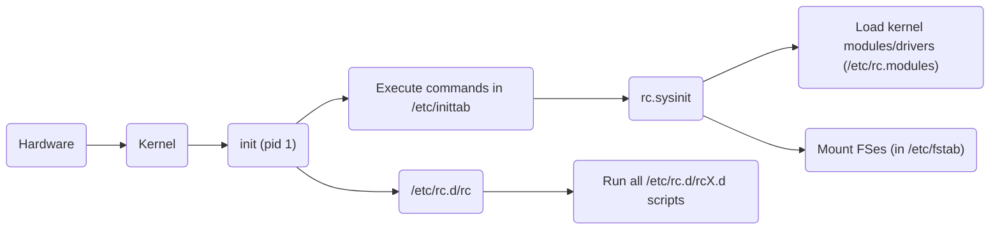

# UNIX Boot and Management with `systemd`

**Gabe Parmer**

© Gabe Parmer, 2024, All rights reserved

-v-

- https://en.wikipedia.org/wiki/Systemd
- https://opensource.com/article/20/4/systemd
- https://ewontfix.com/14/

---

## How does a system boot?

1. HW + firmware (POST)
2. Kernel initialization
3. Create process context for `pid 1` or `/sbin/init`
4. Load modules & device drivers (e.g. for disk)
5. Mount the file systems in `/etc/fstab` (`/dev/sd0` $\to$ `/`)
6. Potentially load more modules/device drivers
7. Execute per-service/application initialization (e.g. start daemons)
8. This includes the GUI or a login prompt/ssh server

---

## SystemV Bootscripts

Outside of [init](https://github.com/mirror/busybox/tree/master/init), these are shell scripts.

---

## SystemV Boot

Designed around

- a simple C `init`,
-

Documented in [LFS](https://www.linuxfromscratch.org/lfs/view/9.1-rc1/chapter07/usage.html), and [redhat](https://docs.redhat.com/en/documentation/red_hat_enterprise_linux/4/html/reference_guide/s2-boot-init-shutdown-init#s2-boot-init-shutdown-init).

https://en.wikipedia.org/wiki/Booting_process_of_Linux
