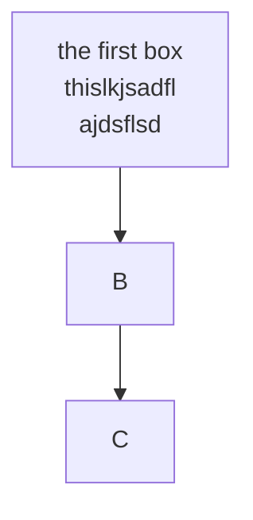

## Advanced Operating Systems

**Gabe Parmer**

:copyright: 2024, Gabe Parmer, All rights reserved

---

## Gabe :wave:

---

## Mermaid test

<!-- classDef default line-height:1.5,font-size:32px; -->
<div class="multicolumn">
<div>

blahblah

</div>
<div>
<div class="center">



</div>
</div>
</div>

---

## Mermaid test

<!-- classDef default line-height:1.5,font-size:32px; -->
<div class="center">


</div>

---

### Commutativity

$$
s(\ldots) \circ s'(\ldots) = s'(\ldots) \circ s(\ldots)
$$

> [The Scalable Commutivity Rule](https://people.csail.mit.edu/nickolai/papers/clements-sc-tocs.pdf): Designing Scalable Software for Multicore Processors, TOCS '24, Clements, et al.
---
### Code

```c
#include <stdio.h>

/*
 * Want to add a lot of lines to
 * make sure
 * that the wrapping
 * or scrolling
 * works correctly
 *
 *
 *
 * ...
 */
int
main(int argc, char *argv[])
{
	if (argc == 1) {
		fprintf(stderr, "Usage: %s arg\n", argv[0]);
		exit(-1);
	}

	return 0;
}

int
main2(int argc, char *argv[])
{
	if (argc == 1) {
		fprintf(stderr, "Usage: %s arg\n", argv[0]);
		exit(-1);
	}

	return 0;
}

```

---

```c [14-23|25-34|4-8]
#include <stdio.h>

/*
 * Want to add a lot of lines to
 * make sure
 * that the wrapping
 * or scrolling
 * works correctly
 *
 *
 *
 * ...
 */
int
main(int argc, char *argv[])
{
	if (argc == 1) {
		fprintf(stderr, "Usage: %s arg\n", argv[0]);
		exit(-1);
	}

	return 0;
}

int
main2(int argc, char *argv[])
{
	if (argc == 1) {
		fprintf(stderr, "Usage: %s arg\n", argv[0]);
		exit(-1);
	}

	return 0;
}

```

---

## Table test

| col1 | col2        | col3        |
|------|-------------|-------------|
| some | information | here        |
| and  | also        | here        |
| but  | what        | about this! |

---

<div class="multicolumn">
<div>

## hi

- some code comment
- and some others

</div>
<div>

```c []
#include <stdio.h>

/*
 * Want to add a lot of lines to
 * make sure
 * that the wrapping
 * or scrolling
 * works correctly
 *
 *
 *
 * ...
 */
int
main(int argc, char *argv[])
{
	if (argc == 1) {
		fprintf(stderr, "Usage: %s arg\n", argv[0]);
		exit(-1);
	}

	return 0;
}

int
main2(int argc, char *argv[])
{
	if (argc == 1) {
		fprintf(stderr, "Usage: %s arg\n", argv[0]);
		exit(-1);
	}

	return 0;
}

```

</div></div>

---

### Commutativity

<div class="multicolumn">
<div>

- Bullet
  - Bullet
- Bullet
- Bullet

</div>

<div>

1. List
   1. List
2. List
3. List

</div>

<div>

Lorem ipsum dolor sit amet, consectetur adipiscing elit, ...

</div>

</div>

---

## Associativity

Some `inline code` as well.

- list
- list2

## second

- list 3

---

## Emoji Collection

- :wave: :shrug: :facepalm:
- :zap: :fire: :boom: :hourglass: :alarm_clock: :clock1: :stopwatch:
- :point_up: :crossed_fingers: :metal: :arrow_right: :arrow_left: :arrows_counterclockwise: :left_right_arrow: :down_arrow:
- :100: :+1: :sunglasses: :exploding_head: :rofl: :smiley: :tada: :white_check_mark: :heavy_check_mark: :x: :negative_squared_cross_mark: :copyright: :flexed_biceps: :brain: :ninja:
- :clown_face: :poop: :sob: :grimacing: :thinking: :scull_and_crossbones: :smiling_face_with_horns:
- :cloud: :battery: :computer: :lock: :unlock: :closed_lock_with_key:
- :no_entry: :warning: :no_entry_sign: :bangbang: :question: :exclamation: :red_exclamation_mark:
- :red_circle: :orange_circle: :yellow_circle: :green_circle: :black_circle: :white_circle:
- :one:  :cool_button:

---

FIN

-v-

Finished
